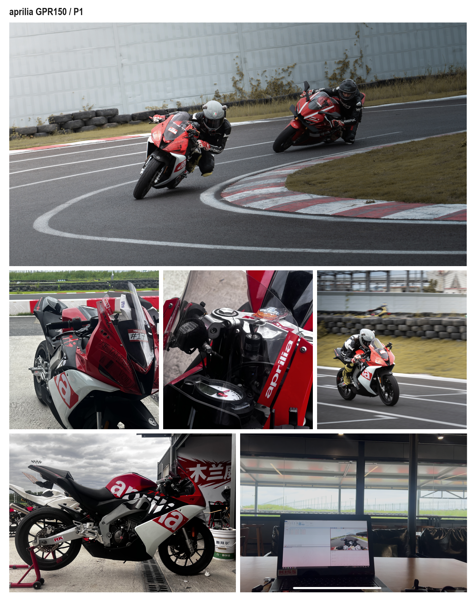

# Track Engineering Portfolio

English · [中文](README.zh-CN.md)

I ride, acquire and analyse motorsport data, and build software for vehicle simulation and control-oriented numerical work. The projects cover telemetry acquisition, line and control comparisons, race review and lap-time modelling.

## Contents

1. **[aprilia GPR150 / P1](case_studies/p1-gpr150-telemetry.md)** — independent acquisition and analysis; spatial event comparison, linked-corner diagnosis and lap-time gain attribution across nine sessions and 71 timed laps.
   - [T2 lines, throttle opening and braking-reference development](case_studies/p1-gpr150-telemetry.md#t2-lines-control-and-reference-development)
   - [OBD, heart rate and lean](case_studies/p1-gpr150-telemetry.md#obd-control-timing-and-rider-state-analysis)
   - [Linked-corner trade-offs and consecutive PBs](case_studies/p1-gpr150-telemetry.md#whole-lap-performance-studies)
   - [Deliberate exercise, gear trial and same-session diagnosis](case_studies/p1-gpr150-telemetry.md#targeted-driving-comparisons)
   - [Detailed analysis](case_studies/p1-gpr150-analysis.md) · [Measurement methods](case_studies/p1-gpr150-methods.md)
2. **[Simulation race engineering](SIM_RACING.md)** — replay, telemetry and race results used together.
   - [MX-5 / Lime Rock](case_studies/lime-rock-mx5-race-analysis.md): qualifying gap, race losses and pedal-trace recovery.
   - [F4 / Paul Ricard](case_studies/paul-ricard-f4-development.md): brake release, exit speed and wheel unloading.
   - [Three-race consistency](case_studies/paul-ricard-race-consistency.md): pace, recovery losses and repeatability.
   - [GT1 / Silverstone](case_studies/silverstone-gt1-sim.md): lockup, tyre state and brake-bias analysis.
3. **[CBR650R / Hualong](case_studies/hualong-cbr650r.md)** — four practice sessions, throttle calibration and comparable-lap selection.
4. **[Vehicle and lap-time modelling](modelling/lap-time-modelling.md)** — measured-data inputs, dyno/gearbox integration, pavement constraints and conditional minimum-time calculation.
   - [CBR650R / P1 inputs, adhesion scenarios and worked results](modelling/cbr650r-p1-model.md)
   - [Runnable vehicle-envelope and fixed-line code](modelling/code/README.md)
5. **[Acquisition and trackside workflow](case_studies/data-acquisition-workflow.md)** — RaceChrono, GPS/IMU/heart rate, BLE OBD, helmet video, Circuit Tools 3 and the pit-room review loop; simulator acquisition and recovery.

## P1 / on track

[Open the P1 project showcase](case_studies/p1-gpr150-telemetry.md) for engineering contributions and selected evidence, or go directly to the [detailed analysis](case_studies/p1-gpr150-analysis.md).

## Engineering contribution

[Team tasks and work evidence](PORTFOLIO.md#what-i-can-contribute) · [Tools and implementation](TECHNICAL_PROFILE.md) · [Session reviews and practice decisions](TRACKSIDE_FEEDBACK_LOOP.md)

## Published material

The repository contains selected analyses, derived figures, aggregate evidence and a short onboard excerpt. Original telemetry, exact GNSS coordinates, full videos, replays and private session records remain in the local archive. The cases describe personal riding and engineering project work.
