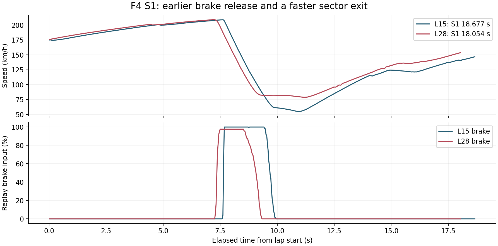

# Simulation racing: driving, data and engineering decisions

[Portfolio contents](README.md) · [中文概述](zh/sim-racing.md)

I drive the sessions and carry out the data preparation, analysis and follow-up work. The simulation archive covers rear-wheel-drive cup cars, front-wheel-drive touring cars, F4, GT1 and GT3. It includes formal online races, practice, native best-lap records, replay reconstruction and continuous telemetry capture.

I locate time losses, inspect the control and vehicle-state traces, then select a driving exercise or setup test for the next run.

## Selected engineering work

| Work | Concrete result | What I did |
|---|---|---|
| [MX-5 / Lime Rock qualifying and race](case_studies/lime-rock-mx5-race-analysis.md) | P16 to P5; accepted race PB 57.784 s; S1 accounts for 60.5% of the qualifying gap | Reconstruct a complete shared replay, reconcile timing sources, quantify valid-lap supply and slow-lap losses, recover the continuous best-lap pedal trace |
| [Three-event race consistency](case_studies/paul-ricard-race-consistency.md) | Compare 26, 12 and 14 completed intervals; separate late-race pace gains from consistency and incident recovery | Apply a common median/MAD rule across different cars and tracks, retain excluded laps, join damage episodes and cuts with the lap timeline |
| [SMP F4 / Paul Ricard development](case_studies/paul-ricard-f4-development.md) | Four consecutive valid practice laps; a 0.623 s S1 gain with earlier brake release and higher exit speed | Match a 78,431-frame replay export to CM lap records, compare controls and wheel loads, inspect a server speed reference, manage distinct setup tests |
| [GT1 / Silverstone](case_studies/silverstone-gt1-sim.md) | Three valid medium-tyre laps: 133.739 to 127.571 s; 50 Hz and 64,544 samples | Analyse time-loss geography, wheel-speed lockup signals, tyre heat/pressure, compound comparability, fuel and brake-bias test design |

L28 gains 0.623 s in S1 through earlier brake release and a stronger exit. Its complete lap is slower than L15, so I selected that opening sequence for further practice within a clean lap.

## Practice breadth

The local per-lap export archive currently contains **331 CSV files**, including a separately recovered reference export. The ordinary export groups include:

| Car / track combination | Saved export files |
|---|---:|
| MX-5 / Lime Rock | 169 |
| Hyundai Elantra N TCR / Zhejiang | 30 |
| Audi RS3 LMS TCR / Zhejiang | 15 |
| Honda Civic TCR / Zhejiang | 4 |
| Lotus Elise SC / Zhejiang | 13 |
| Lynk & Co 03 TCR / Brands Hatch Indy | 14 |
| Audi RS3 LMS TCR / Brands Hatch Indy | 11 |
| MX-5 / Brands Hatch Indy | 21 |
| Toyota GR86 Cup / Tsukuba | 28 |
| Lotus Exige S / Monza | 24 |
| LO206 kart / Conghua | 1 |

The file inventory was checked on 2026-10-01 and includes out-laps, aborted runs and resets. The case studies above use inspected lap selections.

## Working outputs

I produce lap and sector comparisons, control traces, loss budgets, repeatability statistics and damage timelines. For setup tests, I compare the targeted vehicle response, sector performance and consecutive valid laps.

The tools are Python, NumPy, Matplotlib, native binary-file parsing, Content Manager/AC/ACC result records, Live Telemetry and an upstream replay parser. I write the analysis and source-integration tools around those records.

[Figure sources and aggregate results](assets/sim/README.md).

## Acquisition and analysis workflow

The final supporting chapter covers [real-track acquisition, processing and simulator recovery](case_studies/data-acquisition-workflow.md), after the performance cases and modelling work.
