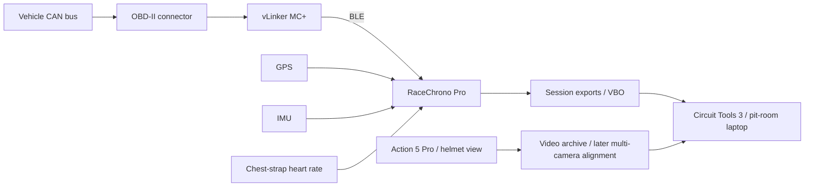

# Real-track acquisition and trackside review

I build and operate a self-funded motorcycle data workflow, covering riding, telemetry capture, onboard video and analysis. The aim is to obtain useful engineering evidence within a limited equipment budget, using accessible hardware and DIY integration.

*Circuit Tools on the pit-room laptop: recorded laps, onboard footage and telemetry available for review at the circuit.*

## The acquisition stack

**RaceChrono Pro** is the logging hub. It connects to GPS, IMU and a chest-strap heart-rate sensor. Vehicle channels arrive through the **vLinker MC+ OBD-II interface over BLE**. A **DJI Osmo Action 5 Pro** records the helmet viewpoint, alongside other onboard camera footage where available.

The vehicle side supplies OBD channels such as RPM and throttle. GPS supplies position, speed and lap context; motion and heart-rate channels add information about riding transitions and rider response. Their individual sampling rates and source definitions remain attached to the exported data.

## Between sessions

During a review break, I use **Circuit Tools 3 on the pit-room laptop** to compare laps, inspect speed and control traces, and revisit the available onboard footage. I combine those observations with riding feedback to choose the focus for the next session: a braking reference, opening sequence, linked-corner line or other specific driving question.

The working loop is **ride → capture → review → choose the next-session focus → ride again**. Review timing depends on the session schedule. For the P1 S04–S07 sequence, the consecutive runs were analysed retrospectively; the general trackside workflow also includes breaks used for review and planning.

## Video and later analysis

Helmet footage gives the rider's view of the approach and visual reference. Other viewpoints provide complementary context. After the track day, I archive the original telemetry and camera files, align the available viewpoints and telemetry clocks, and select the relevant passage for a lap or corner comparison.

The published P1 T2 clip is a completed example of that process: one continuous S04 passage aligned through the VBO video clock, with speed, RPM, throttle, calculated lean and longitudinal G displayed alongside the original sound. Other camera files are aligned separately as each analysis requires them.

## Engineering within the budget

I chose this accessible logger, BLE OBD interface, action-camera and laptop stack within a self-funded budget, rather than investing in an AiM or MoTeC acquisition system. The engineering work is in making the components produce a coherent review: retaining source data, checking channel coverage and clocks, comparing appropriate laps, and connecting a trace to what happened on track.

This approach supports the portfolio's real-track outputs: lap comparison, control-event analysis, mapped lines, aligned video and a concrete next-session plan.

## Archive processing

I retain original RaceChrono exports, available VBO records and camera files by session. Python/NumPy/Matplotlib support the detailed telemetry comparisons; video proxies and aligned excerpts support visual review. Geographic gates provide a common comparison where GPS schemas yield different distance totals. Source-quality checks and channel definitions accompany the selected results.

The [aprilia GPR150 P1 case](p1-gpr150-telemetry.md) and [CBR650R case](hualong-cbr650r.md) apply this workflow to different acquisition conditions.

## Concrete checks that changed the analysis

- **P1 GPS source changes:** source schemas differed between sessions and produced materially different distance totals. Geographic gates supplied a shared comparison; external-GPS precision and satellite fields supported reference-lap selection.
- **P1 source-clock conflict:** some exports retained an old GPS date despite the current session metadata and upload context. Monotonic elapsed/lap timing supported interval analysis while absolute timestamps remained qualified.
- **aprilia GPR150 gear inference:** an ECU speed PID stayed at zero and no direct gear channel was available. Gear labels therefore used GPS/RPM ratio plus rider report, with their inferred status retained.
- **CBR650R throttle calibration:** normalize the observed OBD signal over its recorded endpoints. It is a PID signal, not a measurement of torque or a calibrated physical throttle-plate angle.
- **CBR650R degraded GPS:** merged laps and weak position data in S03 were retained for provisional context but excluded from precise cross-session claims.

## Simulator acquisition and recovery

The simulator extends this workflow with accepted result records, native best-lap binaries, continuous capture and replay recovery. The completed performance cases precede this supporting chapter.

### Source selection

| Source | Useful evidence | Important constraint |
|---|---|---|
| CM/AC/ACC session results | Accepted lap times, sectors, cuts, tyre labels and session identity | Summary timing does not contain a complete high-rate vehicle-state trace |
| Native AC `.tc` | Best-lap speed, normalized pedal inputs and gear | A completed best/last lap can differ from the latest unfinished attempt |
| Replay plus upstream `acreplay-parser` | Session timeline, car positions, controls, wheel channels and damage | Coverage depends on the replay buffer; multiplayer channels can be quantized |
| Direct CSV polling | Packet IDs, time, lap progress, pedals, steering, gear, wheel slip/load/speed, pressure/temperature and assists | Repeated packet IDs and session resets must be checked before counting unique physics samples |
| Live Telemetry | Continuous high-rate vehicle and tyre channels, setup context | Startup metadata can be stale; an empty temporary file is not a completed capture |
| Archived server lapstat | Benchmark speed versus distance | Does not supply the reference driver's control inputs |

### Recovering an event after live logging was unavailable

For the MX-5 Lime Rock race, I combined a shared complete replay with a local tail buffer, official timing and native best-lap data. The 56,969-frame reconstruction restored the lap/traffic/damage timeline. When its brake channel proved binary, the `.tc` reader supplied the continuous accepted-PB input trace. This is a concrete source-recovery workflow rather than an assumption that every recorder saved equivalent data.

The binary-reader work locates the native header, accepted lap time and sample records, then exports speed, track progress, pedals and gear to analysis tables and plots. The upstream replay parser is credited separately; my work is the source integration, timing reconciliation and analysis built around it.

### Recording incomplete and invalid attempts

An earlier MX-5 T1 investigation exposed gaps in lap-based records: the latest unfinished attempt was not the completed lap held in `.tc`, and an alternative lap export had discontinuities around the critical event. The workflow added direct CSV capture so invalid or aborted running would remain inspectable.

A current audit of the preserved direct-capture file finds **152,189 polling rows**, four session-time resets and **18.14% adjacent repeated packet IDs**. I retain packet/time continuity checks instead of presenting polling rows as an equal number of unique physics frames. The current file is an acquisition example; its rows are not assigned wholesale to the earlier failed T1 attempt.

### Preventing silent session contamination

For F4, the 78,431-frame, 30 ms replay export is matched against CM valid-lap transitions. For Silverstone, a later incorrectly labelled telemetry filename is rejected after CM identifies the actual Macau/Evo session. These checks prevent comparing different sessions under the same apparent car/track label.

### Engineering outputs

The resulting analysis stack supports:

- valid-lap and source-coverage tables;
- speed/input traces and brake-event windows;
- four-wheel loading and lockup investigations;
- traffic and damage timelines;
- repeatability and cumulative-loss accounting;
- setup snapshots and separate single-variable test records.

The public [figures and aggregate evidence](../assets/sim/README.md) contain only selected explanatory outputs. Native binaries, complete replays, raw high-rate CSVs and participant-level exports remain private.
