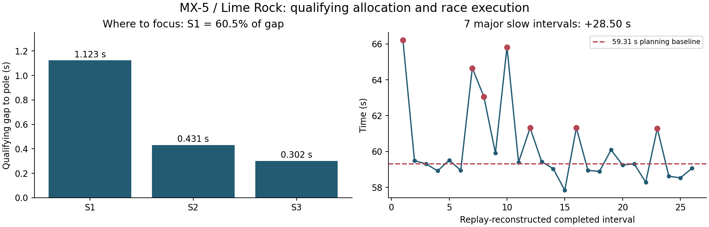
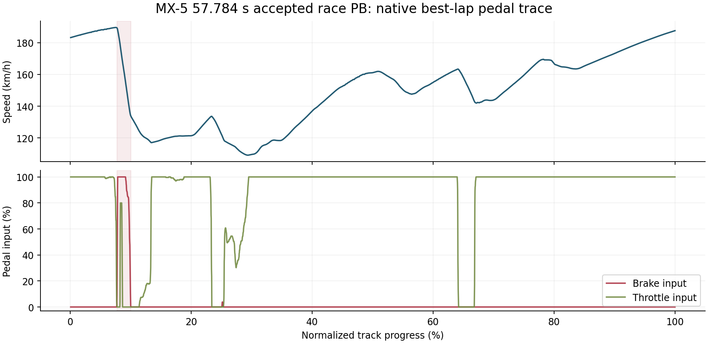

# MX-5 / Lime Rock: qualifying, race execution and pedal analysis

**2026-08-05 · Assetto Corsa · HiPole RCC S31 R5 · Mazda MX-5 Cup · Lime Rock Park, no chicane**

I drove the race and analysed the session afterward. The official finish was P5, with game-side evidence showing P16 at the start and 11 positions gained. The accepted race PB was **57.784 s**. The analysis focused on how qualifying validity, repeatable pace and individual slow laps contributed to the result.

## Recovering the usable dataset

High-rate live logging was disabled before this race because of observed CPU spikes. The local replay buffer retained only the tail, so I obtained a shared complete replay and used upstream `acreplay-parser` 0.3.0 to reconstruct the driver's record: **56,969 frames at 30 ms intervals, 122 columns**. I used the other cars' tracks when examining traffic and comparing race pace.

I joined that reconstruction with CM/AC qualifying results, official result snapshots and the native AC `.tc` best-lap file. Different sources answer different questions: the result snapshot gives accepted times, the replay supplies the race timeline, and `.tc` preserves a continuous normalized brake-input trace for the accepted best lap.

## Qualifying: usable laps before more speed

The result file contains nine driver entries, including the first/out-lap entry: three are valid and six invalid. After excluding the first entry, **3/8 flying attempts were valid**. The qualifying PB was 58.809 s, 1.856 s behind pole.

| Sector | Driver PB | Pole PB | Gap |
|---|---:|---:|---:|
| S1 | 27.228 s | 26.105 s | +1.123 s |
| S2 | 18.782 s | 18.351 s | +0.431 s |
| S3 | 12.799 s | 12.497 s | +0.302 s |

S1 explains **60.5%** of the qualifying gap. Combining only the driver's best valid sectors gives 58.613 s, a 0.196 s theoretical gain. That distinguishes two tasks: create more valid attempts and improve the opening sector, rather than treating sector assembly as the main route to a large gain.

## Race: peak pace, ordinary pace and loss budget

The accepted 57.784 s race PB is 1.025 s faster than qualifying. Replay reconstruction gives a best completed interval of 57.840 s; the two sources are retained separately.

A median/MAD screen retains 19 representative intervals out of 26 reconstructed completed intervals, with median 59.070 s and MAD 0.330 s. Separately, the original planning analysis used a 59.31 s baseline to measure slow-lap losses:

- Seven intervals above 61 s accumulated **28.50 s** above that baseline.
- All positive deviations from the baseline summed to **30.48 s**.

These are different sums. The loss budget makes consistency an actionable priority even though a competitive individual lap exists. The replay analysis localized repeated losses to linked corners and exits, while checking nearby-car positions before attributing a slow lap to traffic.

## Native best-lap braking trace

I parsed the native best-lap record to recover the 57.784 s lap's speed, throttle, brake input and gear trace. The principal braking event spans approximately **7.718%-10.015%** track progress, reaches full normalized brake input and reduces speed from about **189.3 to 134.0 km/h**. A later light application is about 3.84% input.

The shared multiplayer replay stores this driver's brake channel as only 0/255, so it can support brake-on timing but not the continuous release shape. The native best-lap file supplies that missing input shape. Normalized pedal input is distinct from hydraulic pressure or wheel brake force.

## Follow-up work

The review produced specific targets: increase valid flying laps in the ten-minute qualifying window, concentrate practice on S1, and reduce the recurring large-loss laps instead of chasing another isolated PB.

The official result counts 25 laps, while AC and replay reconstruction contain 26 completed crossing intervals. The qualifying tail buffer does not preserve the complete 58.809 s lap. Those limitations prevent a full qualifying-versus-race control overlay, but do not prevent the qualifying-sector and race-consistency analysis above.

See [aggregate evidence and source notes](../assets/sim/README.md).
