# aprilia GPR150 / P1 — detailed analysis

[Project showcase](p1-gpr150-telemetry.md) · [Portfolio contents](../README.md)

**September 2026 · my riding, data acquisition and analysis**

I rode and logged repeated P1 practice sessions, then joined the recorded lines, OBD channels and onboard footage to examine how the driving developed. T1 is the approach kink; T2 is the main left after the straight. This case follows the braking reference, corner-exit control, linked-corner trade-offs and the final sequence of personal bests.

## In this case

- [Programme and lap progression](#result)
- [T2: lines, control and reference development](#t2-lines-control-and-reference-development)
- [Onboard video and the physical reference](#t2-onboard-example-developing-a-repeatable-braking-reference)
- [How much of the T2 gain survives downstream?](#quantified-t2-progression-across-sessions)
- [Linked corners and the final PB](#whole-lap-performance-studies)
- [OBD, heart rate and lean](#obd-control-timing-and-rider-state-analysis)
- [S09 deliberate right-turn exercise](#3-a-deliberate-right-turn-exercise)
- [Gear choice and same-session comparisons](#supporting-driving-and-setup-comparisons)
- [Onboard gallery](#video-frame-gallery)
- [Methods and source evidence](p1-gpr150-methods.md) · [Acquisition workflow](data-acquisition-workflow.md)

## Result

The programme covered **nine sessions and 71 timed laps**. The recorded reference sequence progressed **60.022 → 58.977 → 56.644 → 55.859 → 55.496 s**. The final S08 result followed three consecutive PBs: **55.957 / 55.920 / 55.496 s**.

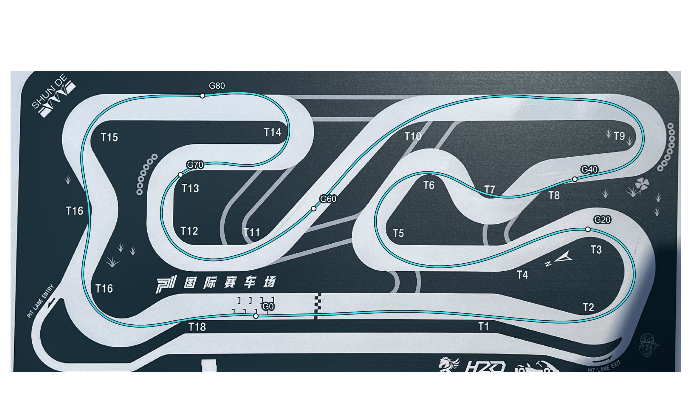

The photographed P1 board locates the recorded reference path and common geographic gates. All board overlays use the same registration as the T2 comparison; metric views retain the measured line differences.

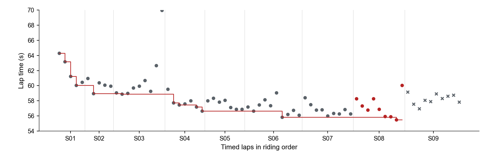

Each point is one recorded lap; the red step follows the running PB. S09 crosses mark deliberate right-turn exploration. S02 and S04–S08 supply the common external-GPS comparison; S01/S03 remain visible as programme context. The 60.022 s reference is included in the earlier acquisition-schema context.

## T2: lines, control and reference development

Over several sessions I moved the braking reference downstream, eventually using the raised kerb at the T1 kink as the visual marker before the main T2 left. The following study connects approach position, driven line, throttle opening and downstream speed across **47 timed laps from S02 and S04–S08**.

### Braking later did not require a later lean landmark

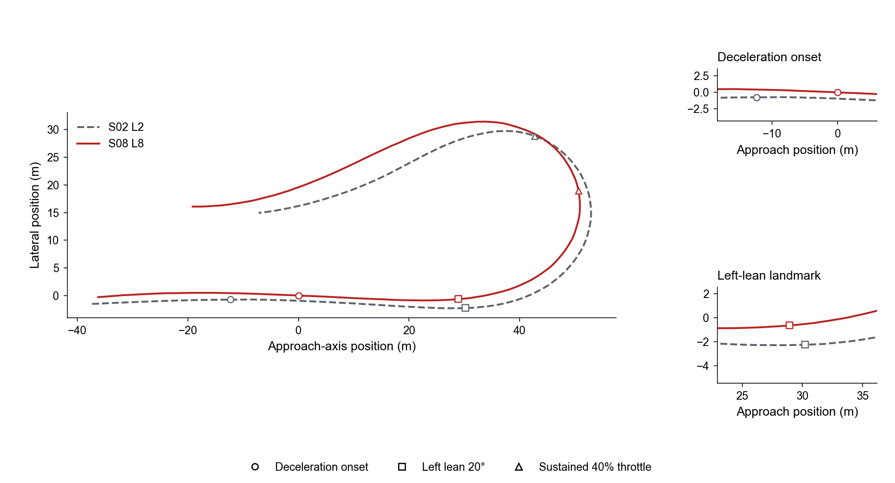

**S02 L2 → S08 L8:** the recorded deceleration onset moves approximately **12.3 m downstream**, while the sustained 20° left-lean landmark stays in a similar approach position. The two laps therefore show a substantial change in the approach without an equivalent downstream shift of the lean landmark.

Both lines use the same metric coordinate frame. The larger diagram shows the corner sequence; the detail views isolate the approach events. Circles identify deceleration onset, squares sustained left lean of 20°, and triangles sustained 40% throttle.

### Earlier opening appears in the control sequence

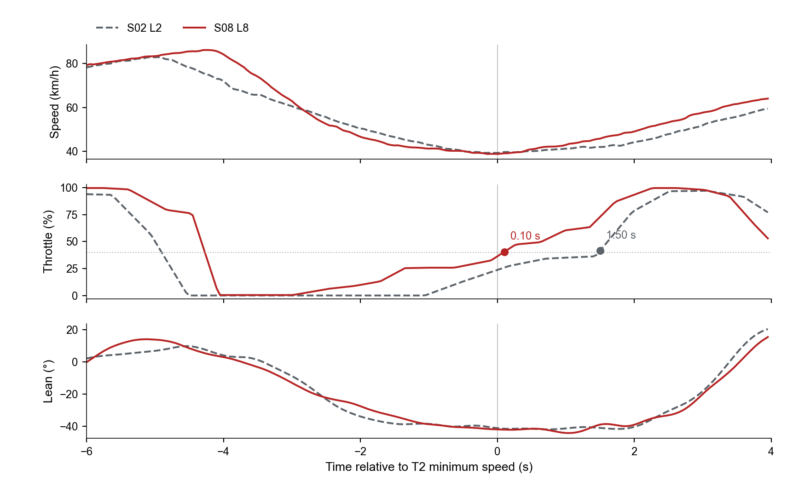

The curves align each lap at its T2 minimum speed, marked by the vertical zero line. Sustained 40% throttle arrives **1.50 s after minimum speed in S02 L2**, compared with **0.10 s in S08 L8**. The speed traces then separate through the exit while both laps remain substantially leaned over.

At the fixed T2 exit gate, speed increases **58.8 → 64.6 km/h**. At the downstream gate it increases **43.4 → 46.0 km/h**. The measured T2-plus-downstream package improves by **0.722 s**: **0.569 s in T2** and **0.152 s after it**, with rounding applied to the components.

The full-lap PB and the fastest opening package capture different strengths. S07 L5 traverses the same opening package in **13.940 s**, compared with **14.192 s for S08 L8**, despite its lower T2 exit speed. Exit speed and the following transition must therefore be read together.

A second pair illustrates the distinction: **S04 L7 → S06 L7** has later deceleration and a later lean landmark, but the delay to sustained 40% opening grows **0.35 → 0.95 s**. The effect of moving the reference depends on the accompanying entry and corner sequence.

### The reference moved, returned and became more repeatable

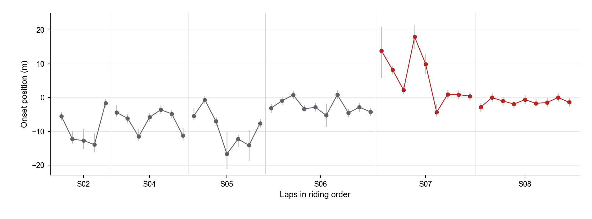

Each point is one timed lap; session boundaries preserve the riding order. Position is projected onto the common approach axis, with **S08 L8 onset at 0 m**. Pale bars show how the detected point changes when the deceleration threshold varies from -0.10 to -0.20 G.

The clearest reversal occurs within S07. Its first five laps have median onset **+9.9 m**, while the final four return to **+0.6 m**. S08 stays near that returned region. The sequence records downstream shifts and returns within the practice day; my riding notes supply the reasons for individual adjustments.

The logged full position range narrows from **22.3 m in S07** to **2.8 m in S08**. The middle-half ranges narrow from **9.0 m** to **1.1 m**. Varying the event threshold preserves the broad difference between the sessions. The result describes relative consistency in the recorded onset position.

S04–S07 were ridden consecutively without interim telemetry debriefs. This analysis reconstructs the practice retrospectively.

### Event definitions

GNSS supplies position and speed; OBD supplies throttle and engine speed. Deceleration onset uses calculated longitudinal G ≤-0.15 for 0.20 s, and the lean landmark uses calculated left lean ≥20° for 0.20 s. Stable opening uses normalized OBD throttle ≥40% for 0.30 s. The main-corner minimum is selected before the fixed geographic T2 exit plane.

[Event definitions and source details](p1-t2-development-method.md) · [Aggregate per-lap evidence](../assets/p1/aprilia_GPR150_T2_exploration.json)

## T2 onboard example: developing a repeatable braking reference

[Watch the original-audio clip](../assets/p1/aprilia-gpr150-t2-braking-reference.mp4) — S04 L4, source-video 06:21–06:41. The approach shows the tucked position, the raised kerb at the T1 kink, the transition upright and the main T2 left. This intermediate-session example gives the physical setting for the measured S02/S08 comparison.

The red square marks S08 L8's deceleration onset, at the raised-kerb reference I eventually adopted; the grey square marks S02 L2 farther upstream. The same schematic transform places both recorded paths on the existing P1 layout. The video is S04 L4, while the map compares S02 L2 and S08 L8.

The overlay joins GNSS speed, OBD RPM/throttle and calculated lean/longitudinal G to the recovered VBO video clock. L4 begins approximately **2.21 s into the excerpt**. Engine sound is retained and the HLG source is converted to SDR for playback. [Alignment details](p1-gpr150-methods.md#video-and-map-alignment).

## Quantified T2 progression across sessions

The final PB retains **0.722 s** across T2 and the following section relative to S02 L2: **0.569 s in T2**, then **0.152 s downstream**. T2 exit speed rises **58.8 → 64.6 km/h**, and downstream gate speed **43.4 → 46.0 km/h**.

S07 L5 nevertheless completes this package faster: **13.940 s**, against **14.192 s in S08 L8**. Its lower T2 exit speed, **62.8 km/h**, accompanies a shorter downstream traversal. The final PB gains **0.059 s in T2** against this lap, then returns **0.311 s** in the following section. The best exit-speed result and the best complete sequence belong to different laps.

The pattern also extends beyond the chosen PBs. The package median improves **14.955 → 14.278 s** from S02 to S07, then becomes **14.550 s** in S08. S02-to-S08 median exit speed rises **58.8 → 62.2 km/h**. The full per-session comparison is retained in the [aggregate evidence](../assets/p1/t2-progression-summary.json).

## Whole-lap performance studies

### 1. Linked sequence: a quicker right-hand block can cost the next transition

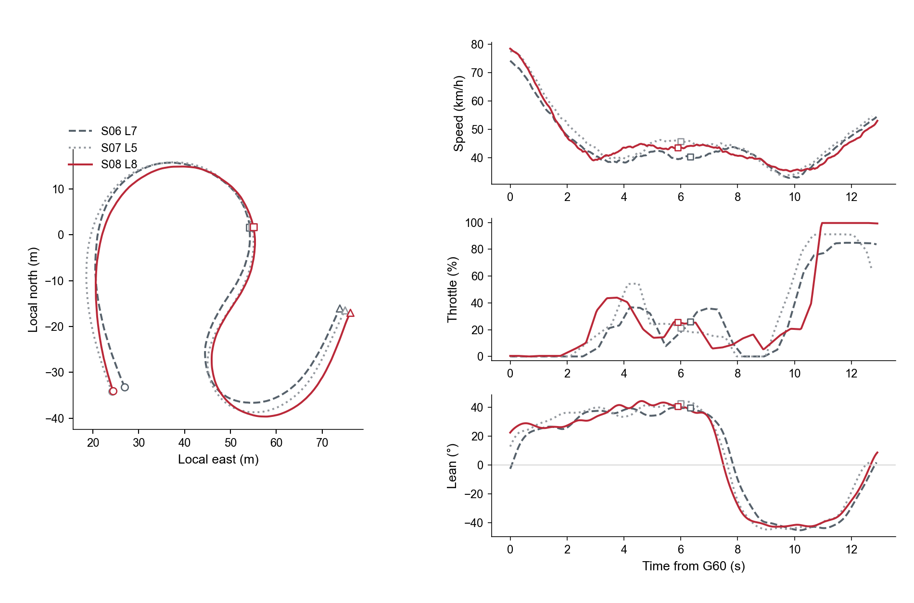

The left panel shows the recorded G60–G80 paths in one coordinate frame. Circles mark G60, squares G70 and triangles G80. The three traces start at the same geographic G60 plane; squares in the traces mark each lap's G70 crossing. Positive lean is right, negative lean left.

**S06 L7 → S08 L8:** G60–G70 improves **0.431 s**, while G70–G80 loses **0.461 s**. The combined section is **0.030 s slower**. S07 L5 completes both blocks **0.189 s faster** than S08 L8 despite its slower whole lap.

The red PB trace develops right lean earlier, then crosses through upright into left lean earlier on this elapsed-time axis. Its throttle opening also begins earlier in the first block, but returns to partial input before the next acceleration. These changes sit beside a different path through the reversal. The paired views expose the driving sequence behind the split-time trade-off; equal elapsed time in the traces does not imply equal track position.

S09's deliberate exercise sharpens the same contrast: L10 takes **5.702 s** through G60–G70 and **7.528 s** through G70–G80. Its **13.230 s** total remains slower than the selected PB sequence. The linked-section outcome gives context to the locally faster right-hand block.

### 2. S08 consecutive PBs: where the final 0.424 s came from

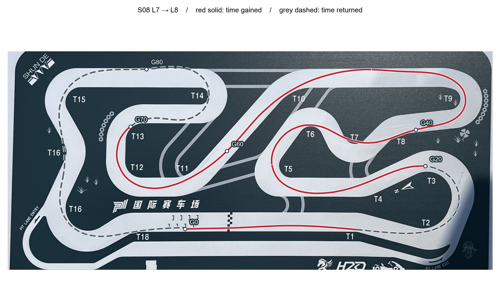

Cyan solid intervals gain time; amber dashed intervals return time. The quantitative chart below uses red and grey for the same interval results.

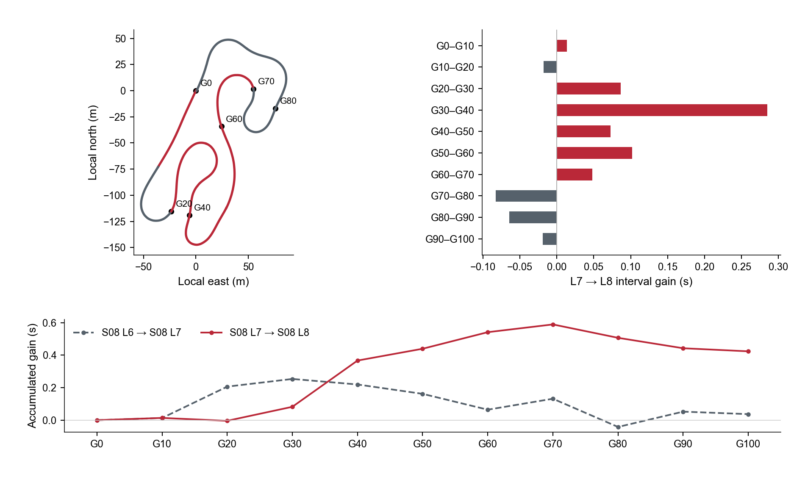

Red path intervals gain time from **L7 to L8**; grey intervals return it. The adjacent bars quantify those same fixed geographic intervals. The lower panel compares accumulated gains for both PB steps.

**L6 → L7:** T2 and its following section gain **0.322 s**, but the rest of the lap returns **0.285 s**, leaving **0.037 s** at the finish. **L7 → L8:** the opening package gains only **0.036 s**; the rest contributes **0.388 s** of the final **0.424 s** improvement.

The strongest final-step contribution is **G20–G40: 0.371 s**. G40–G60 adds **0.175 s**. L8 reaches G70 approximately **0.59 s ahead**, then finishes **0.424 s ahead** after later losses. The map makes the location of the main contribution visible.

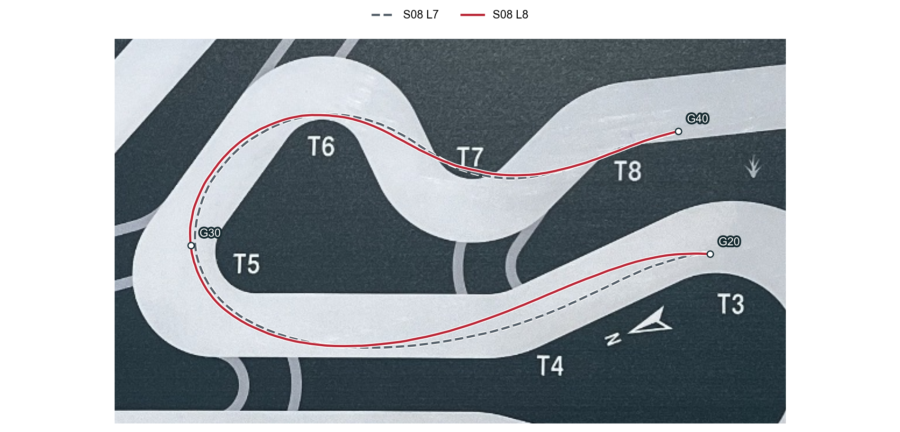

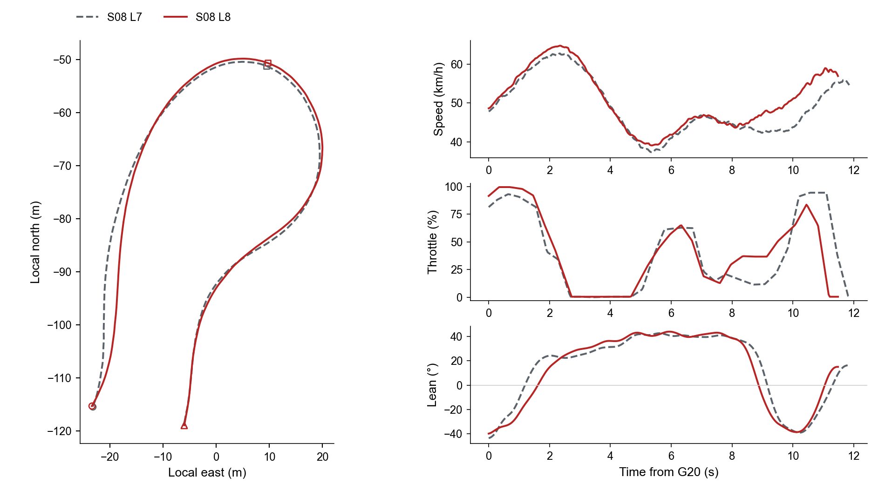

This closer view follows the largest contributing package. Circles, squares and triangles mark G20, G30 and G40. L8 carries more speed at all three gates: **48.6 / 39.2 / 56.9 km/h**, against **47.8 / 38.1 / 54.6 km/h in L7**.

The two paths remain close through much of the right-hand arc, while the red trace maintains more throttle after the first opening falls back to partial input. Around 8–10 s from G20, that input accompanies stronger speed recovery and an earlier right-to-left reversal on the elapsed-time axis. The measured section time falls **11.850 → 11.479 s**. This locates a concrete control-and-transition difference within the PB, while retaining line and timing as separate observations.

### 3. A deliberate right-turn exercise

**Method:** compare the exercise at the same G60–G80 gates as the earlier linked-corner study, then inspect the driven path, right-lean duration and following acceleration.

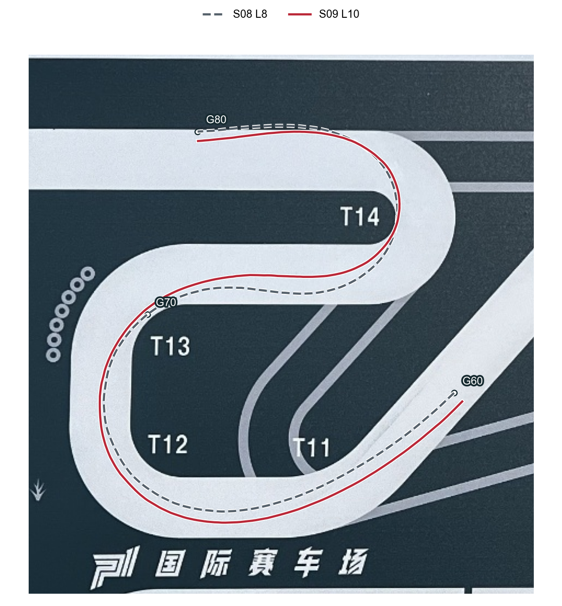

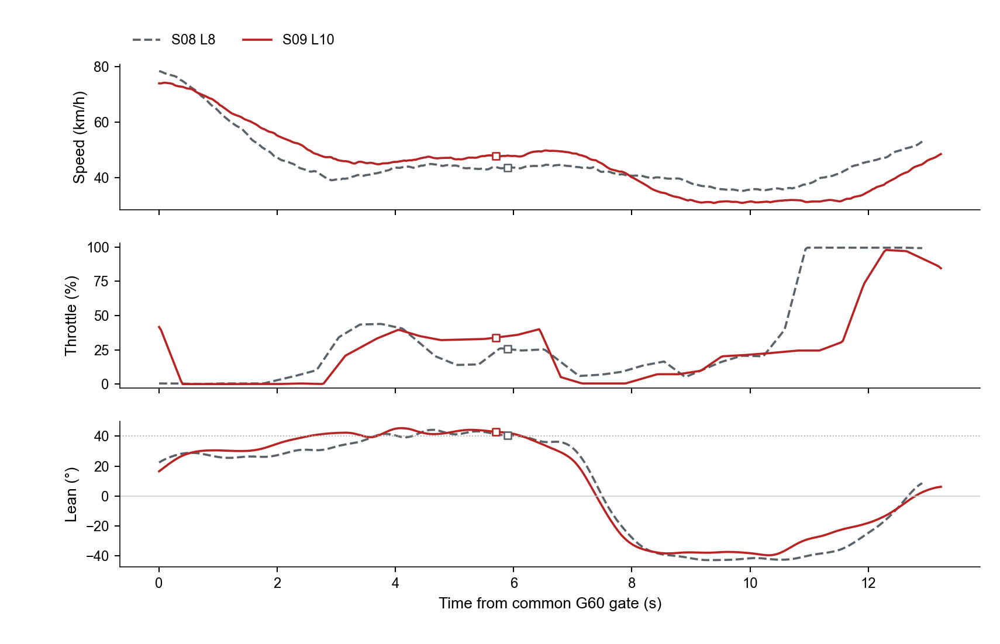

The S09 L10 trace spends more of the first block near or above **40° right lean**, carries more speed through that block and reaches G70 sooner. Its following leftward transition carries less speed and accelerates later. Squares mark the common G70 crossing; equal elapsed times elsewhere can correspond to different positions.

S09 L10 improves G60–G70 by approximately **0.194 s** against S08 L8, then loses approximately **0.510 s** through G70–G80. The complete pair is **13.230 versus 12.914 s**, exposing the downstream cost of the locally quicker exercise.

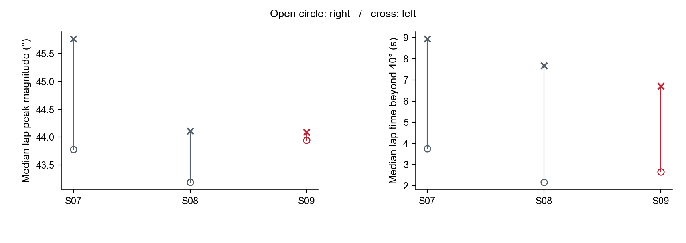

Whole-session medians supply context: right-side time beyond 40° changes **2.172 → 2.665 s** from S08 to S09, while median peak right lean changes **43.187° → 43.944°**. This separates the shape and duration of the exercise from the peak-angle number. The exercise has its own objective; its whole-lap distribution remains separate from the PB progression.

[Directional and comparison aggregates](../assets/p1/p1-supporting-comparisons.json)

## OBD, control timing and rider-state analysis

### Deceleration: position, speed loss and recovery

**Method:** compare the complete deceleration sequence at a common minimum-speed event, retaining the sustained onset position and speed loss as separate quantities.

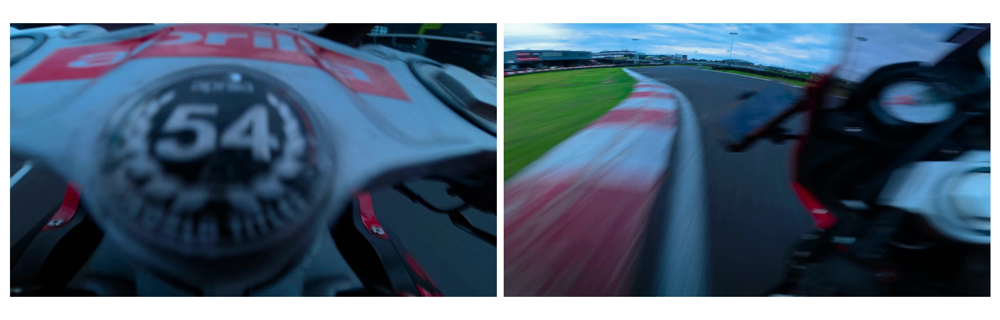

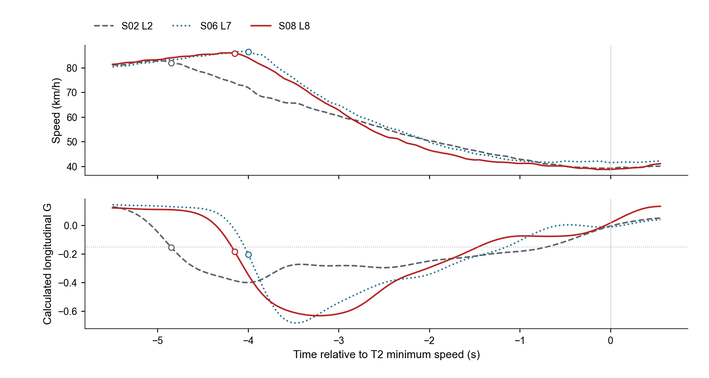

Open circles mark the archived sustained deceleration onset; zero marks each lap's T2 minimum speed. The G trace uses a 0.25 s moving mean for display. The speed view reveals the longer early slowdown in S02, alongside the later, stronger deceleration episodes in S06 and S08.

S02 L2 / S08 L8 have archived filtered troughs of approximately **−0.40 / −0.63 G** and effective average deceleration from onset to minimum of **0.25 / 0.32 G**. S06 L7 reaches approximately **−0.68 G**. Reading onset, speed loss and recovery together describes the approach sequence; the calculated net G includes engine braking and coasting.

[Position and repeatability study](#t2-lines-control-and-reference-development) · [Source and event definitions](p1-gpr150-methods.md#t2-events)

### Engine-speed recovery: what the speed trace leaves out

The [aligned S04 excerpt](#t2-onboard-example-developing-a-repeatable-braking-reference) supplies the physical approach and engine audio. The following traces compare the measured S02/S07/S08 laps.

All three laps align at their T2 minimum-speed event. S02 L2 and S08 L8 reach similar minimum engine speeds, approximately **6,383 / 6,356 rpm**, then exit at **8,688 / 9,346 rpm**. The throttle sequence supplies the context: near-closed time in T2 falls **3.75 → 1.50 s**, and stable 40% opening moves **+1.50 → +0.10 s** after minimum speed.

S07 L5 has a different engine-speed recovery, exiting at approximately **7,106 rpm** despite a broadly comparable GPS exit speed. Reading RPM and throttle alongside speed exposes drivetrain behaviour that speed alone conceals. I recorded my gear-choice trials alongside the speed/RPM groupings; transient ratio changes also reflect clutch state and channel timing.

The PB's early opening is a selected-lap result. S08's median stable-40% delay is **1.20 s**, showing a meaningful gap between the best execution and the session's usual sequence.

### Lean: the shape and duration of the cornering episode

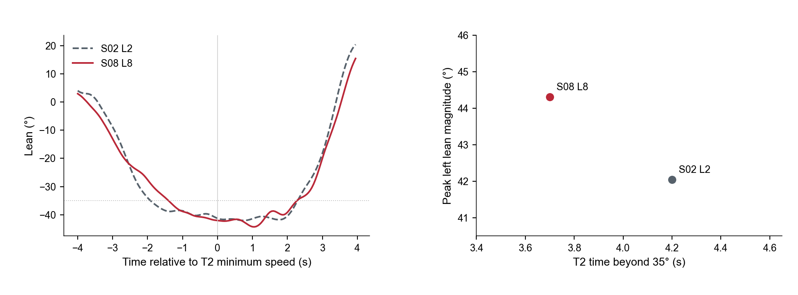

The left panel retains physical left/right sign and aligns at minimum speed. The dotted line marks **35° left lean**. The right panel pairs time beyond 35° with peak left-lean magnitude for the same two laps.

S02 L2 → S08 L8 increases peak left lean **42.0° → 44.3°**, while time beyond 35° falls **4.20 → 3.70 s**. The quicker lap passes through its deep-lean episode in less time, with the earlier opening already visible in the T2 control comparison. Reading magnitude, duration and recovery together is more informative than comparing maximum angle alone.

### Heart rate: inspect the response shape against the session pattern

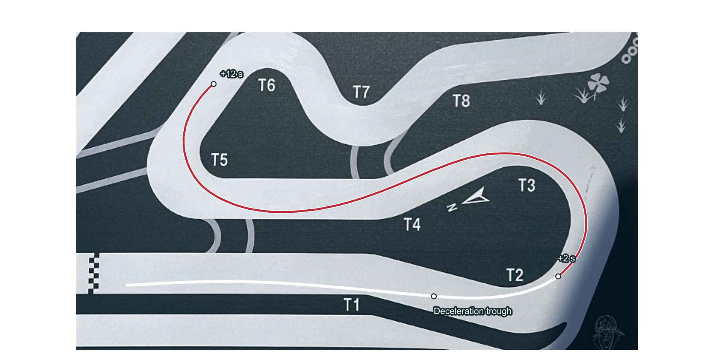

The post-event window extends beyond the approach into the following corners.

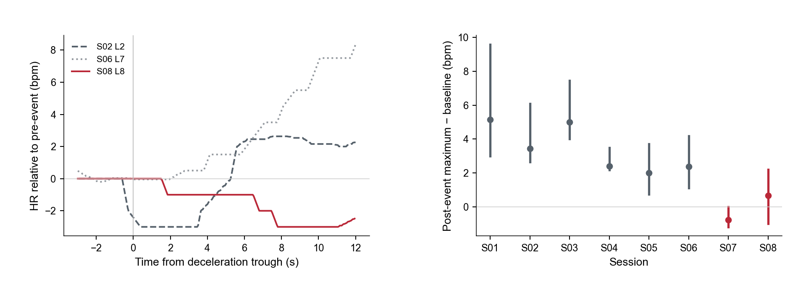

The left panel aligns five-second median-filtered HR at the approach-deceleration trough and subtracts the pre-event baseline. S06 L7 rises across the later part of the window, while S08 L8 trends downward. The right panel retains each session's median response and middle-half range across all HR-covered timed laps.

The +2 to +12 s post-event maximum is approximately **+8.5 bpm in S06 L7** and **−1.0 bpm in S08 L8**. Session medians also change: **+5.1 bpm in S01**, **−0.8 in S07**, **+0.7 in S08**. The event-window shape varies across laps and sessions; it does not establish a repeated sharp braking-related spike. That window spans the subsequent corner sequence and HR sensor delay. S09 has no HR channel.

## Supporting driving and setup comparisons

### Gear choice: does avoiding a shift preserve the next corner?

Before the September run, I asked whether using third gear in T2 could avoid an exit throttle interruption, then deliberately tried it in S02. I compared OBD RPM and throttle with GPS speed across the full opening sequence.

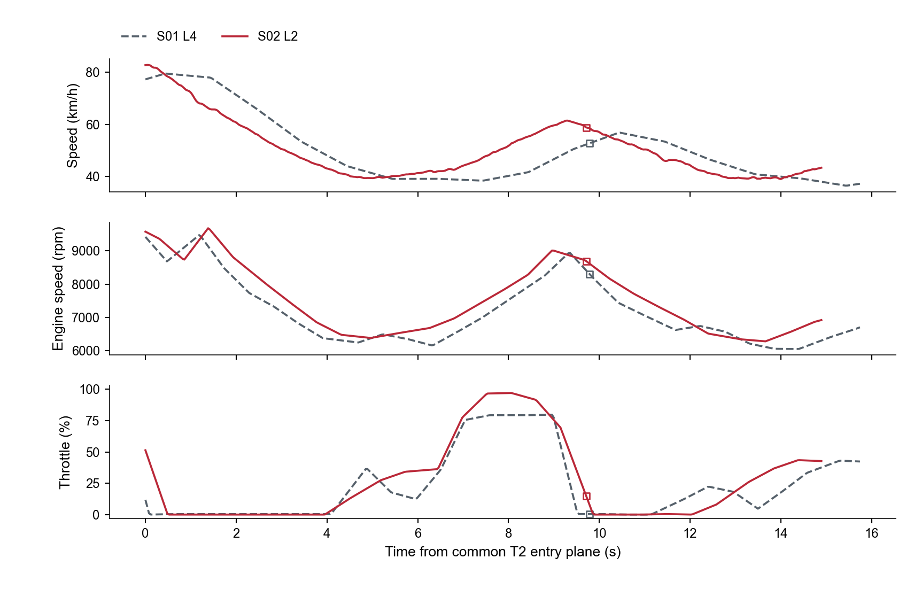

Both traces start at the common T2 entry plane. Squares mark T2 exit and the traces continue to the downstream plane. This keeps the drive phase and the following slowdown visible together.

The retained geographic-gate results for **S01 L4 / S02 L2** give **0.081 s in T2**, **0.771 s downstream** and **0.851 s across the package**. I rode T2 in third gear during the trial. The pair shows the result of the complete driving sequence; RPM/throttle add drivetrain context, with line and entry changes also present.

### Same-session contrast: entry speed versus linked-corner carry

**Method:** select consecutive laps from the same session, hold the geographic comparison planes fixed, and inspect how entry, opening and the following corner differ.

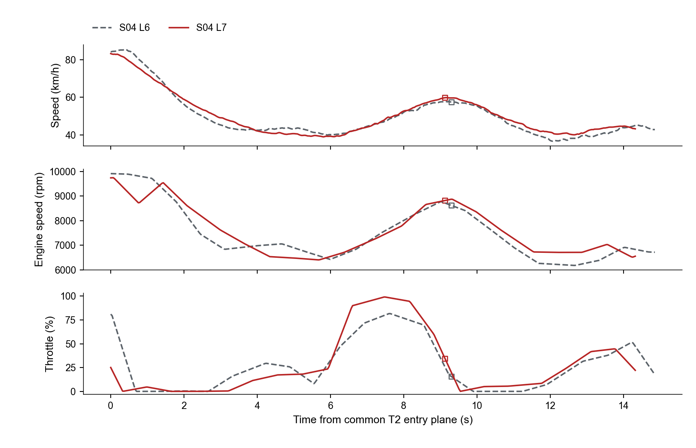

S04 L7 enters T2 slightly slower than L6 (**83.4 versus 84.0 km/h**) and reaches a lower T2 minimum (**38.9 versus 39.8 km/h**), yet carries approximately **40.0 versus 36.5 km/h** through the following right-hander. The later acceleration phase retains a higher throttle input and stronger engine-speed recovery in the plotted sequence.

The fixed T2-plus-downstream package improves approximately **0.540 s**; full laps are **56.644 versus 57.201 s**. The comparison illustrates a useful diagnostic: the entry-speed number alone would miss the performance retained through the next corner.

### Tyre-pressure context

I recorded cold pressures of **1.75 / 1.70 bar**, front/rear, and a later front reading of **1.84 bar**. After a compromised rear hot measurement, I reset the rear to **1.80 bar hot**. These values provide session context; the programme does not isolate a pressure effect on lap time.

## Video frame gallery

Selected onboard frames retain the daylight, overcast and night conditions across the programme. The aligned T2 clip above supplies the timed example; these stills provide visual context for the wider archive.

  
  
  

  
  
  

  
  
  

## Methods and source evidence

[Measurement definitions and alignment](p1-gpr150-methods.md) cover common geographic gates, source clocks, calculated channels and comparison precision. [Per-lap gate results](../assets/p1/p1-development-detail-summary.json), [T2 results](../assets/p1/t2-progression-summary.json), [channel summaries](../assets/p1/aprilia-gpr150-channel-summary.json) and [47-lap reference history](../assets/p1/aprilia_GPR150_T2_exploration.json) retain the published numerical evidence. Original telemetry and full videos remain in the private track archive.

[Portfolio contents](../README.md) · [Acquisition and trackside workflow](data-acquisition-workflow.md)
