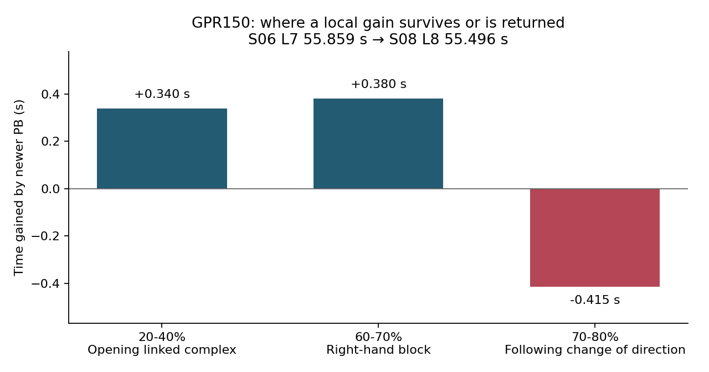

# Case study: P1 GPR150 real-track telemetry

**Date:** 2026-09-03
**Vehicle:** GPR150
**Context:** repeated practice sessions on a compact P1 circuit
**Tools:** RaceChrono Pro, VBO/Circuit Tools exports, Python/NumPy/Matplotlib/OpenCV, and multi-camera onboard video
**Read this case for:** a real-track driver-development programme: gear choice, linked-corner speed, direction-change losses, measurement quality and selected onboard-video evidence.

## Result

The programme covered nine sessions and 71 timed laps. The credible reference sequence improved from `60.022 s` to `55.496 s`:

| Reference | Best lap |
|---|---:|
| Earlier reference | `60.022 s` |
| 2026-09-03 S02 external-GPS reference | `58.977 s` |
| 2026-09-03 S04 external-GPS reference | `56.644 s` |
| 2026-09-03 S06 external-GPS reference | `55.859 s` |
| 2026-09-03 S08 L8 | `55.496 s` |

The last step was supported by a three-lap progression (`55.957 / 55.920 / 55.496 s`), rather than one isolated timing sample. Session 9 became deliberate right-turn exploration, so its slower distribution is not used as a like-for-like pace or fatigue conclusion.

## Acquisition and alignment

The real-track programme used 25 Hz GNSS, IMU, and OBD-II acquisition. The private P1 archive also contains per-session VBO/Circuit Tools records and onboard video/proxy exports; one session has multiple camera files, and the public evidence package now includes selected frames from daylight, overcast, and night running. The raw files and camera identifiers remain private.

For this case, cross-source comparison used geographic gates because the available GPS schemas produced materially different distance totals. The frame gallery proves that the visual record exists and can be inspected; it does not by itself prove cross-camera synchronization. The next video step is to align a visible start/finish crossing with the stored lap markers, then test whether telemetry changes correspond to a visible corner, line, body movement, or control action.

## What was measured or observed

- External-GPS quality and satellite/precision indicators were checked before using a lap as a reference.
- Lap and sector progression was compared with geographic gates rather than blindly joining incompatible distance channels.
- T1 gear was inferred from the GPS/RPM ratio and rider report; there was no direct ECU gear channel.
- Throttle continuity, longitudinal acceleration, GPS yaw, lean episodes, and linked-corner timing were used as analysis signals.
- Selected video frames were reviewed as visual context for corner geometry, onboard display state, and changing daylight/night conditions; a frame is treated as context until its timestamp is explicitly aligned.
- The fastest laps did not require a new extreme lean event. The more repeatable gain was linked-corner continuity and reduced dead time.

## Engineering interpretation

The analysis separated:

- **Measurement:** recorded timing, GNSS/IMU/OBD channels, and video availability.
- **Derived quantity:** geographic gate times, GPS/RPM gear inference, sector allocation, and normalized comparisons.
- **Hypothesis:** a gain came from preserving speed through a linked transition, rather than simply entering the first corner faster.

The evidence supports linked-corner and control-continuity hypotheses. The video archive makes those hypotheses testable, but the selected stills do not identify every rider action without explicit time alignment. The 71-lap progression is also not an independent vehicle-performance benchmark.

## Driver development: research questions from the acquired data

The most useful output of this programme is a set of corner-development questions, supported by retained traces and specific next-test criteria. The original rider discussion, nine CSV exports, derived lap/sector tables and drivetrain correction remain available in the local archive.

### 1. Gear choice: does avoiding a shift preserve the next corner?

Before the September run, I asked whether T1 could be taken in third gear to avoid an exit throttle interruption. I then deliberately tried third gear in S02. Comparing S01 L4 with S02 L2, T1 itself improved by only **0.081 s**, while the interval from the T1 exit gate to the following right-hander's exit gained approximately **0.671 s**. The complete opening complex gained **0.752 s**.

That makes the research question about the full linked section: does a retained gear reduce shift-related interruption enough to offset lower instantaneous drive? The next comparison should retain entry and exit gates, record control interruptions and RPM recovery, and require repeated clean laps. The observed pair motivates the test; it does not isolate gear choice from every other driving change.

Gear identification uses rider-confirmed third-gear running and the corrected speed/RPM grouping. A later review corrected an earlier cluster mislabel; the withdrawn second-gear/sprocket interpretation is not used here. There is no direct ECU gear channel.

### 2. The following right-hander: entry attack or linked-corner continuity?

Two same-session laps give a useful contrast:

| S04 lap | T1 entry speed | T1 minimum | Minimum through following right-hander | Full lap |
|---|---:|---:|---:|---:|
| L6 | 84.0 km/h | 39.8 km/h | approximately 36.5 km/h | 57.201 s |
| L7 | 83.4 km/h | 38.9 km/h | approximately 40.0 km/h | 56.644 s |

The quicker lap enters T1 more slowly but carries more speed through the following right-hander. The opening 40% gains approximately 0.95 s, with about 0.39 s returned later in the lap. The next question is which combination of exit placement, direction-change timing and throttle continuity preserves that downstream speed.

The test requires a camera-to-lap time anchor and fixed geographic gates around both corners. Compare the approach, minimum-speed region, control continuity and exit together, then check the whole linked-section time. The GPR record calls this the following right-hander; assigning it a specific **T2** label requires an agreed track-map/video reference. The detailed July T2 video review belongs to the CBR650R programme and is kept separate.

### 3. Right-to-left transition: why is a gain immediately returned?

In the final credible PB step, **55.859 → 55.496 s**, the 60-70% right-hand block gains **0.380 s**, but the immediately following 70-80% direction-change block returns **0.415 s**. Across those two blocks together, the newer PB is therefore about 0.035 s slower, despite its stronger first block.

This gives a more precise target than increasing peak right lean: preserve the acquired speed through the next direction change. The proposed review compares line, pickup timing, body reset and throttle continuity on aligned video and telemetry. The acceptance criterion is a faster combined 60-80% interval on repeated laps, with the neighbouring sections retained in the comparison. The 20-40% linked opening complex, which gains approximately 0.340 s in this PB step, provides a second comparison region.

### 4. Tyre-pressure context: build a controlled setting test

The session record includes rider-reported cold pressures of **1.75 / 1.70 bar** front/rear and a later front reading of **1.84 bar**. The original rear hot measurement was compromised by an incorrectly seated gauge; the subsequent **1.80 bar hot** was a reset value, not a natural cold-to-hot rise.

A useful follow-up is first to obtain repeatable pressure measurements with the same gauge and recorded time since stopping, then attach them to a comparable stint. Any subsequent pressure trial needs a defined baseline, one changed setting and repeated linked-corner results under recorded conditions. The existing programme does not establish that a pressure change caused the lap-time gains.

## What is completed and what remains

Completed work includes source-quality checks, geographic comparisons, lap/sector allocation, rider-confirmed gear trials, throttle-signal interpretation and video-frame preparation. The questions above turn those outputs into a further development programme. Full GPR per-camera telemetry alignment and causal validation of line or setup changes remain open. S04-S07 were ridden without reading the interim analysis, so their changes are retrospective observations rather than successive coached tests.

Source basis: the dated September live review, corrected drivetrain note, geographic PB-sector table and the original rider discussion. The new linked-corner figure is regenerated from the retained PB-sector table; it uses derived aggregates rather than publishing coordinates or raw telemetry.

## Video frame gallery

These are selected stills extracted from the P1 onboard archive. They are included to make the analysis inspectable at a human scale: daylight and night running, corner geometry, onboard display context, and the change in visual conditions across the programme. The images are frame exports, not claims that every camera was time-synchronized at the displayed moment.

  
  
  

  
  
  

  
  
  

## Analysis figures

### Lap progression

The running-PB line records the sequence `60.022 → 58.977 → 56.644 → 55.859 → 55.496 s`. The S09 points remain visible for context, while the session's deliberate right-turn exploration is kept separate from a like-for-like pace conclusion.

### Sector gain distribution

The heatmap shows why a local improvement cannot be read as a whole-lap explanation. In the final `55.859 → 55.496 s` step, the `60–70%` interval gained `0.380 s`, while the immediately following `70–80%` interval returned `0.415 s`. That pattern motivates video alignment across the linked transition.

### T1 gate versus full lap

The T1 gate is a derived geographic comparison. Gear labels are rider-reported or inferred from GPS/RPM ratio, not a direct ECU gear channel. The figure therefore supports a continuity interpretation rather than a claim that one gear is universally faster.

## Why this case matters

This is the clearest example of the project treating telemetry as an engineering record rather than a dashboard: source clocks and data quality are audited first, derived features are labelled, and interpretations are left open until the missing visual or physical evidence is available.
