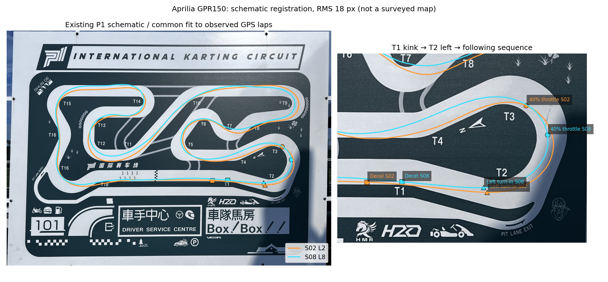
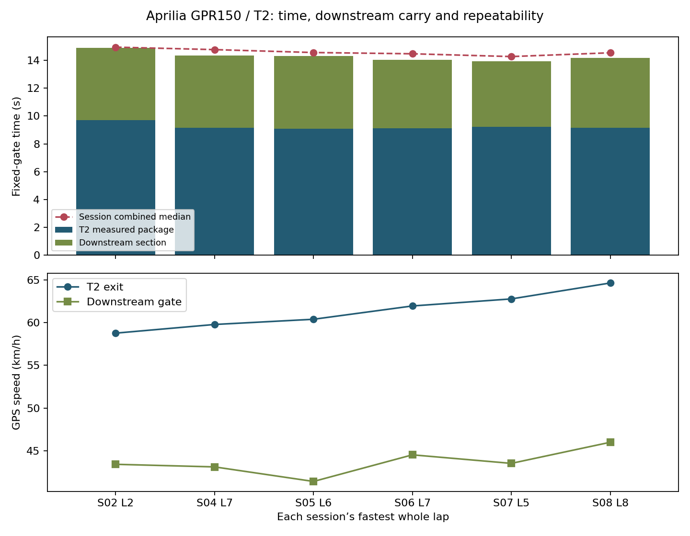
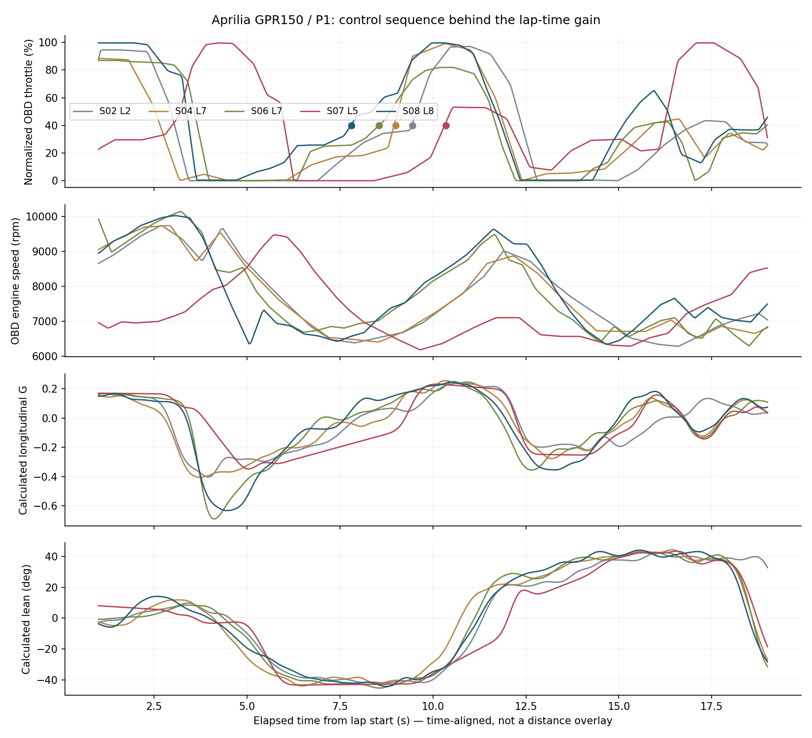
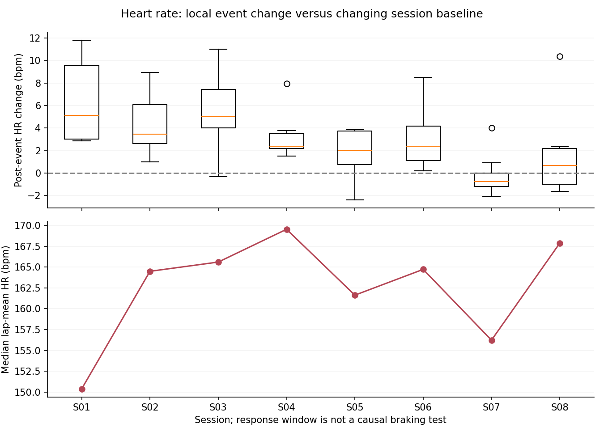
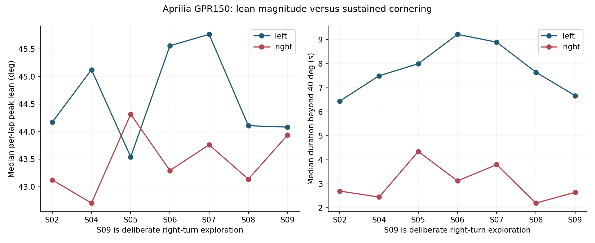
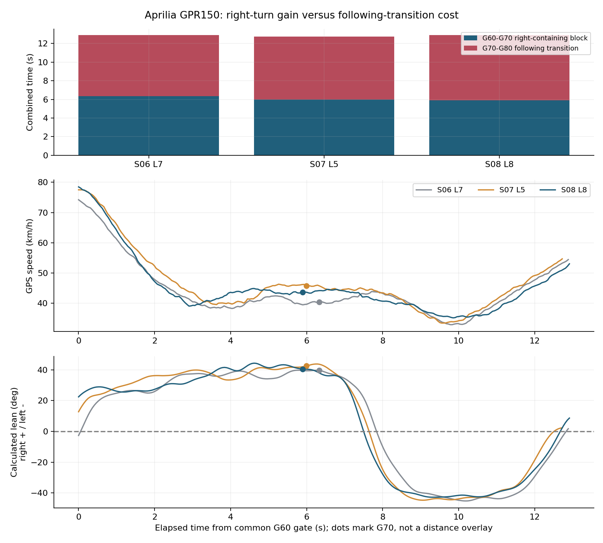
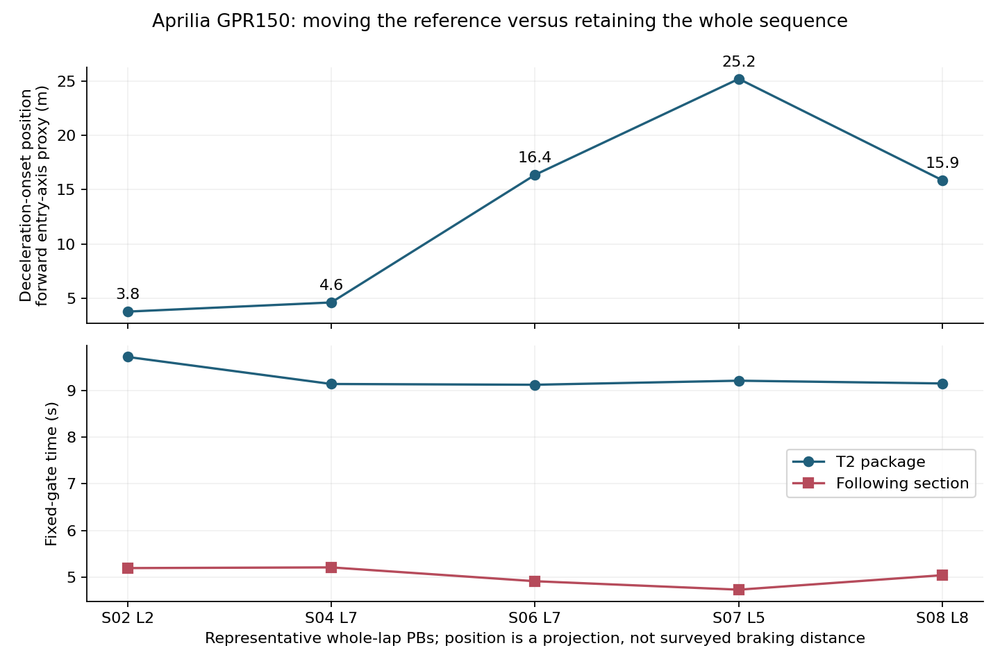
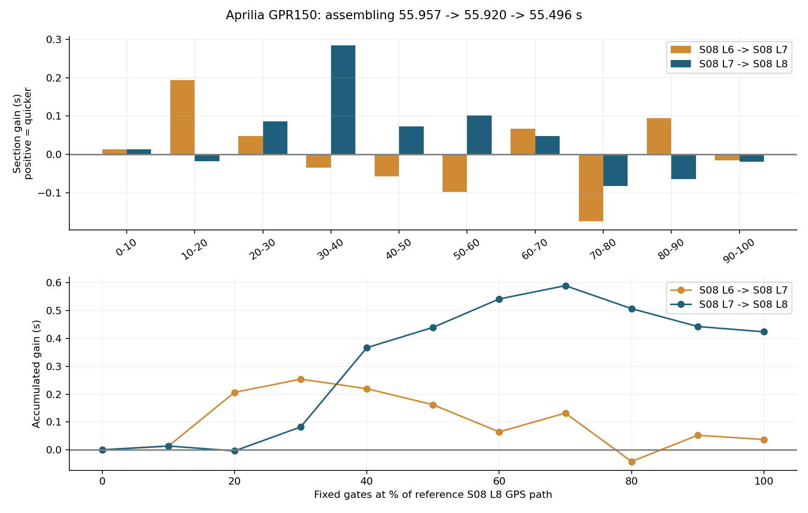
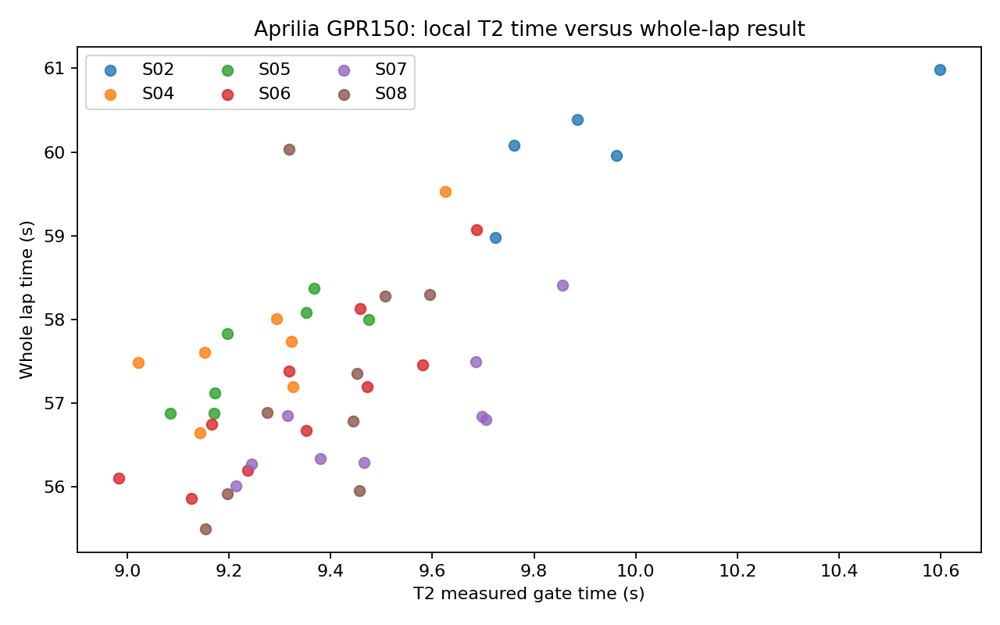

# Case study: P1 Aprilia GPR150 real-track telemetry

**Date:** 2026-09-03
**Vehicle:** Aprilia GPR150
**Context:** repeated practice sessions on a compact P1 circuit
**Tools:** RaceChrono Pro, VBO/Circuit Tools exports, Python/NumPy/Matplotlib/OpenCV, and multi-camera onboard video
**Read this case for:** personally acquired real-track data, T2 braking-reference development, linked-corner trade-offs, consecutive-PB gain allocation and aligned onboard evidence.

## Result

The programme covered nine sessions and 71 timed laps. The credible reference sequence improved from `60.022 s` to `55.496 s`:

| Reference | Best lap |
|---|---:|
| Earlier reference | `60.022 s` |
| 2026-09-03 S02 external-GPS reference | `58.977 s` |
| 2026-09-03 S04 external-GPS reference | `56.644 s` |
| 2026-09-03 S06 external-GPS reference | `55.859 s` |
| 2026-09-03 S08 L8 | `55.496 s` |

The last step was supported by a three-lap progression (`55.957 / 55.920 / 55.496 s`), rather than one isolated timing sample. Session 9 became deliberate right-turn exploration, so its slower distribution is not used as a like-for-like pace or fatigue conclusion.

## Acquisition and alignment

The real-track programme used 25 Hz GNSS, IMU, and OBD-II acquisition. The private P1 archive also contains per-session VBO/Circuit Tools records and onboard video/proxy exports; one session has multiple camera files, and the public evidence package now includes selected frames from daylight, overcast, and night running. The raw files and camera identifiers remain private.

For this case, cross-source comparison used geographic gates because the available GPS schemas produced materially different distance totals. The S04 L4 excerpt below now joins one continuous onboard segment to the VBO clock and OBD/calculated channels. This establishes a bounded video example; the wider multi-camera archive still requires separate alignment.

## T2 onboard example: developing a repeatable braking reference

**[Watch/download the 1080p original-audio clip](../assets/p1/aprilia-gpr150-t2-braking-reference.mp4)** — S04 L4, source-video 06:21–06:41. This is a practice example, rather than the final PB.

**Read the picture and map together:** the cyan square marks the derived S08 L8 deceleration onset. The rider identifies this location with the T1 raised-kerb reference eventually adopted after progressively moving the braking point downstream. The orange square is the S02 L2 onset, farther upstream. This connects a physical visual reference to a later-session telemetry event. The video shows S04 L4, so it illustrates the approach and execution in an intermediate session; it is not footage of the cyan S08 lap. Map registration is schematic, and net deceleration remains a proxy for brake application.

**Rider feedback:** over several sessions I progressively moved my braking reference downstream, eventually using the raised kerb at the T1 kink as the visual marker for the T2 approach. The clip shows the tucked straight approach, the transition upright beside that reference, the main T2 left and the following exit/linked turn. Selecting a repeatable physical marker makes the driving experiment concrete: vary the approach, then compare deceleration, minimum speed, opening and downstream carry.

The rider account describes the learning process. The selected video illustrates its execution at this point in the programme; it does not, alone, establish which session first adopted the marker or that every change resulted from an interim telemetry debrief. S04–S07 were ridden consecutively without reading those interim reviews.

**Alignment:** the VBO contains `avisynctime` in milliseconds and several overlapping camera indices. The continuous main-video clock is recovered from its index-1 mapping, then carried through the later index switches. The clip spans the end of L3 and the T2 sequence in L4; the L4 start marker is approximately **2.21 s into the excerpt**. The onboard display shows the previous lap rounded to **57.5 s**, matching the CSV L3 interval of **57.488 s**. Picture checks at the upright/deceleration transition and sustained main-left lean agree with the telemetry sequence at approximately half-second inspection resolution. The mapping is a logger alignment with visual checks, rather than a frame-accurate brake-pressure measurement.

The overlay shows GNSS speed, OBD RPM and the recorded throttle channel, calculated lean (L/R), and calculated longitudinal G. It preserves engine sound. The raised-kerb caption marks the rider's visual reference; net deceleration is the logged proxy because no brake-pressure/switch channel is available. The BT.2020/HLG source is explicitly converted to BT.709 SDR using a Hable tone map and highlight desaturation for browser playback. Only the short rendered excerpt and a poster are published; original video/VBO records remain private.

## What was measured or observed

- External-GPS quality and satellite/precision indicators were checked before using a lap as a reference.
- Lap and sector progression was compared with geographic gates rather than blindly joining incompatible distance channels.
- T2 gear was inferred from the GPS/RPM ratio and rider report; there was no direct ECU gear channel.
- Throttle continuity, longitudinal acceleration, GPS yaw, lean episodes, and linked-corner timing were used as analysis signals.
- Selected video frames were reviewed as visual context for corner geometry, onboard display state, and changing daylight/night conditions; a frame is treated as context until its timestamp is explicitly aligned.
- The fastest laps did not require a new extreme lean event. The more repeatable gain was linked-corner continuity and reduced dead time.

## Engineering interpretation

The analysis separated:

- **Measurement:** recorded timing, GNSS/IMU/OBD channels, and video availability.
- **Derived quantity:** geographic gate times, GPS/RPM gear inference, sector allocation, and normalized comparisons.
- **Hypothesis:** a gain came from preserving speed through a linked transition, rather than simply entering the first corner faster.

The evidence supports linked-corner and control-continuity hypotheses. The video archive makes those hypotheses testable, but the selected stills do not identify every rider action without explicit time alignment. The 71-lap progression is also not an independent vehicle-performance benchmark.

## Quantified T2 progression across sessions

Fixed geographic gates were applied to all **71 recorded laps**. The table below uses each session's fastest complete lap, rather than selecting its fastest T2 independently. S02 and S04-S08 retain the common external-GPS programme. S01/S03 have different GPS schemas; S09 changes the exercise objective. They remain in the aggregate evidence but are outside this main progression comparison.

| Session / fastest full lap | T2 | After T2 | Combined | T2 exit | Downstream gate |
|---|---:|---:|---:|---:|---:|
| S02 L2 (58.977 s) | 9.723 s | 5.191 s | 14.914 s | 58.8 km/h | 43.4 km/h |
| S04 L7 (56.644 s) | 9.142 s | 5.206 s | 14.348 s | 59.8 km/h | 43.1 km/h |
| S05 L6 (56.879 s) | 9.084 s | 5.222 s | 14.307 s | 60.4 km/h | 41.4 km/h |
| S06 L7 (55.859 s) | 9.126 s | 4.909 s | 14.035 s | 61.9 km/h | 44.5 km/h |
| S07 L5 (56.016 s) | 9.213 s | 4.727 s | 13.940 s | 62.8 km/h | 43.5 km/h |
| S08 L8 (55.496 s) | 9.154 s | 5.038 s | 14.192 s | 64.6 km/h | 46.0 km/h |

### What improved, and how much survived the exit?

- **S02 L2 → final PB S08 L8:** T2 improves by **0.569 s** and the downstream section by **0.152 s**. The complete measured package improves by **0.722 s** (4.8%). T2 exit speed rises **58.8 → 64.6 km/h** (+5.9), while speed at the downstream gate rises **43.4 → 46.0 km/h** (+2.6).
- **S02 L2 → best complete opening package, S07 L5:** T2 improves by **0.510 s**, the downstream section by **0.464 s**, and their sum by **0.974 s** (6.5%). Almost 48% of this combined gain occurs after the T2 exit. S07 L5's lower T2 exit speed (62.8 km/h) still produces a faster combined section than the final whole-lap PB.
- **Repeatability:** the complete-package median changes **14.955 → 14.278 s** from S02 to S07, then returns to **14.550 s** in S08. This supports a repeated improvement, with incomplete retention in the final session. S02-to-S08 median T2 exit speed rises **58.8 → 62.2 km/h**, so the higher exit speed is not confined to the PB.

The final PB's downstream minimum speed is approximately **39.1 km/h**, versus **38.9 km/h** in S02 L2. Its larger exit speed has therefore not become a similarly large minimum-speed gain through the following corner. Different driven lines also change travel distance between the gates, so the time gain is not attributed wholly to exit speed.

The next research target is to combine the final PB's stronger T2 exit with the S07 opening package's shorter traversal time, while checking line, direction-change timing and control continuity. This is an observed opportunity, not a predicted additive lap-time gain.

### Measurement definition

T2 entry and exit use fixed perpendicular geographic planes from the Sep 2 S04 L3 reference (2.82 and 12.37 s on that reference); the downstream endpoint is at reference **18.50 s**. All 71 laps cross the three-plane package in time order, using linear interpolation between samples and no nearest-point fallback.

The previous-day 60.022 s reference gives broader context: T2 9.550 → 9.154 s (about **0.40 s**), downstream 6.142 → 5.038 s (about **1.10 s**), combined 15.692 → 14.192 s (about **1.50 s**), with T2 exit 50.9 → 64.6 km/h. Because that comparison crosses acquisition schemas, the same-programme table above carries the main conclusion.

Interpolated timing and GPS speeds are derived measurements. Results are interpreted at tenths-of-a-second scale; displayed milliseconds support checking the arithmetic rather than claiming millisecond physical accuracy. [Aggregate inputs and results](../assets/p1/t2-progression-summary.json) retain per-lap values without coordinates, raw traces or private participant records.

## OBD, control timing and rider-state analysis

**Circuit layout:** T1 is the approach kink; **T2 is the main left after the straight**, followed by the next linked turns. Fixed geographic gates define the measured comparison section; turn-in and apex positions are assessed separately.

### Use the channels according to their source

The exports retain OBD **RPM, throttle PID and coolant temperature**, HRM **heart rate**, GNSS **position/speed/precision**, and RaceChrono **calculated longitudinal/lateral G and lean**. The G/lean channels are explicitly tagged `calc` in these files; they are not independent measurements of brake pressure, tyre force or calibrated chassis roll. The ECU speed PID is unusable, so GPS speed and OBD RPM are joined instead.

OBD throttle is normalized over the archived 1.57-94.51% signal range. A stable opening means staying above the chosen threshold for 0.30 s; 20/40/80% landmarks are retained separately. Near-closed means below 5% normalized input. This distinguishes maintenance input, a committed roll-on and effective full opening; it does not convert the PID into torque.

### Opening timing and engine-speed recovery

| Lap | Stable 40% opening after minimum speed | Near-closed throttle in T2 | Exit RPM | Filtered peak deceleration proxy |
|---|---:|---:|---:|---:|
| S02 L2 | +1.50 s | 3.75 s | 8688 rpm | -0.40 G |
| S04 L7 | +0.35 s | 3.20 s | 8820 rpm | -0.40 G |
| S06 L7 | +0.95 s | 2.50 s | 8805 rpm | -0.68 G |
| S07 L5 | +1.05 s | 2.95 s | 7106 rpm | -0.35 G |
| S08 L8 | +0.10 s | 1.50 s | 9346 rpm | -0.63 G |

S02 L2 reaches stable 40% opening at **9.45 s** from lap start; S08 L8 reaches it at **7.80 s**, about **1.65 s earlier**. Relative to minimum speed, that is **+1.50 → +0.10 s**. Near-closed time in the measured T2 package falls **3.75 → 1.50 s**. These changes give a control-level explanation to investigate alongside the measured exit-speed gain, rather than reporting the speed alone.

RPM adds a second distinction: minimum T2 RPM is similar (about **6,383 / 6,356 rpm** in S02/S08), but exit RPM rises **8,688 → 9,346 rpm**. S07 L5 exits at about **7,106 rpm** despite a similar GPS exit speed. The speed trace alone hides this difference. Gear/clutch state and cross-channel timing must be checked before attributing it to a particular gear change; RPM/speed ratios during a transient are not a direct gear sensor.

The final PB's opening timing is stronger than the session median: S08's median stable-40% delay is about **1.20 s** after minimum speed. The target is therefore to reproduce the PB's control sequence over consecutive laps.

### Straight-end deceleration and turn-in proxies

The principal approach-deceleration event is located before the T2 minimum-speed point. Onset is a sustained calculated longitudinal value below **-0.15 G for 0.20 s**. Main left turn-in is a sustained calculated lean below **-20° for 0.20 s**, avoiding the preceding T1 kink. These rules locate repeatable signals; there is no direct brake-switch/pressure or steering-angle channel.

S02 L2's onset is approximately **3.10 s**, versus **3.55 s** in S08 L8. Their filtered deceleration troughs are about **-0.40 / -0.63 G**. Speed loss divided by elapsed time from this onset to minimum speed gives an effective average deceleration proxy of about **0.25 / 0.32 G**. That interval also includes engine braking, rolling resistance, coasting and cornering. A stronger trough is not, by itself, proof of more efficient brake use; S06 L7 reaches about -0.68 G without owning the final PB.

The local forward approach-axis projection places the selected S02/S08 onset about **3.8 / 15.9 m beyond the baseline entry reference**. This is a roughly **12 m downstream shift** in a position proxy, distinct from the lap-relative timing comparison. It is not surveyed braking distance, and onset identifies net deceleration rather than brake application.

The map below places these events on a shared schematic registration. Turn-in/line interpretation still requires aligned video, especially when a GPS difference is comparable to measurement or map-fit uncertainty.

### Map the events back to the existing P1 layout

The [video and line map shown together above](#t2-onboard-example-developing-a-repeatable-braking-reference) connect the physical braking reference to the later-session event markers.

A single similarity fit registers the S08 L8 GPS path to the existing P1 main-corridor rail. The same transform is applied to S02 and all event positions; laps are not fitted independently. The map marks deceleration onset, sustained main-left lean and stable 40% opening, making the T1-kink/T2-left sequence explicit.

The schematic fit has about **18 px RMS discrepancy**, approximately 3 m at the fitted scale. Its start-line location is also imperfect. This is a visual correspondence to the previously prepared map, not a surveyed pavement boundary or a metre-accurate apex measurement. It supports asking whether the later roll-on follows a different exit path; it does not prove a specific curb-to-curb line is optimal. Exact GPS coordinates remain private.

### Heart-rate response: event windows versus session baseline

For each recorded lap with HR coverage, the approach-deceleration trough is the event anchor. HR is smoothed with a five-second median; the pre-event reference is -3 to -1 s and the post-event maximum is +2 to +12 s. The latter window includes subsequent cornering/control events and sensor delay, so it cannot isolate a physiological braking response.

S06 L7 shows approximately **+8.5 bpm** in this window; S08 L8 shows approximately **-1.0 bpm**, despite its stronger measured deceleration than S02. Across-session response medians range from about **+5.1 bpm in S01** to **-0.8 in S07** and **+0.7 in S08**. A repeatable sharp post-braking spike is therefore **not established**. HR context is kept separate from a claim that braking caused a reaction or that a low value proves low workload. S09 has no HR channel.

### Lean as a sequence and duration

The analysis retains physical left/right sign, peak magnitude, duration beyond 35°/40°, and the roll-in/roll-out sequence. S02/S08 selected T2 peaks are about **42.0° / 44.3° left**, while T2 duration beyond 35° changes **4.20 → 3.70 s**. The faster lap does not simply spend longer at deep lean. Its earlier sustained opening and different transition sequence are stronger questions to test against the picture.

Whole-lap distributions retain S09's deliberate right-turn exploration separately from PB attempts. Calculated lean and lateral G share source assumptions and are not independent corroboration of grip. The [aggregate channel results](../assets/p1/aprilia-gpr150-channel-summary.json) record thresholds, selected laps and session summaries. Signals are resampled to a common 20 Hz analysis grid; this does not create independent 20 Hz OBD or HR measurements.

## Three performance studies

These comparisons locate where time was gained, where it was returned, and how the final PB was assembled. They combine recorded lap timing, fixed geographic gates, calculated lean, GNSS speed and the rider's physical braking reference.

### 1. Linked sequence: a quicker right-hand block can cost the next transition

| Lap | G60–G70: right-containing block | G70–G80: following transition | Combined |
|---|---:|---:|---:|
| S06 L7 | 6.327 s | 6.557 s | 12.884 s |
| S07 L5 | 5.996 s | 6.728 s | 12.725 s |
| S08 L8 | 5.896 s | 7.018 s | 12.914 s |

From S06 L7 to the final PB, the first block gains **0.431 s**, while the following transition loses **0.461 s**. The complete sequence is approximately **0.030 s slower**. S07 L5 completes the pair **0.189 s faster** than S08 L8 despite a slower whole lap. This separates the best local sequence from the best whole-lap result.

The speed and calculated-lean traces begin at the same geographic G60 gate. They show the right-lean episode, reversal into the next left and speed recovery together. The dots mark each lap's G70 crossing; an equal elapsed time is not necessarily an equal track position. The traces support investigating how entry, exit placement and the direction change interact; identifying a specific body movement requires aligned footage of those laps.

The deliberate S09 right-turn exercise gives another useful contrast: L10 takes **5.702 s** through G60–G70, but **7.528 s** through the following block. Its **13.230 s** combined time is slower than S08 L8. This is a local-exercise outcome, rather than a like-for-like session pace comparison.

### 2. T2 braking reference: position changes and downstream retention

The selected PBs place net-deceleration onset at approximately **3.8, 4.6, 16.4, 25.2 and 15.9 m** along the common forward entry-axis projection in S02, S04, S06, S07 and S08. Together with the [onboard example and P1 map](#t2-onboard-example-developing-a-repeatable-braking-reference), this connects the rider's gradual adoption of the raised T1 kerb to a measurable approach-event shift.

The representative laps also show that the progression is not monotonic: S07's selected onset is farther downstream than S08's. S07 L5 completes T2 plus the following section in **13.940 s**, against **14.192 s** for S08 L8. S08 has the higher T2 exit speed (**64.6 versus 62.8 km/h**), yet gives back **0.311 s** downstream after gaining **0.059 s** in T2. A later onset or higher exit speed therefore needs to be evaluated against the complete linked section.

These are net-deceleration proxies and projected positions, not brake-pressure measurements or surveyed braking distances. The rider account describes repeated on-track attempts; the numerical comparison is retrospective and does not establish a telemetry debrief between each stint.

### 3. S08 consecutive PBs: where the final 0.424 s came from

| S08 lap | Whole lap | T2 + following section |
|---|---:|---:|
| L6 | 55.957 s | 14.550 s |
| L7 | 55.920 s | 14.228 s |
| L8 | 55.496 s | 14.192 s |

**L6 → L7:** the opening package gains approximately **0.322 s**, but the rest of the lap returns **0.285 s**. The whole-lap improvement is only **0.037 s**. This identifies a meaningful opening improvement that the final timing alone would hide.

**L7 → L8:** the opening package improves by only **0.036 s**; the remaining lap contributes approximately **0.388 s** of the **0.424 s** improvement. The fixed G20–G40 interval contributes **0.371 s**, and G40–G60 adds **0.175 s**. Together those middle intervals gain approximately **0.546 s**, partly offset elsewhere. The final PB was assembled primarily beyond the measured T2 opening package.

The accumulated comparison makes the give-back visible: L8 builds a lead of about **0.59 s** by G70, then finishes **0.424 s** ahead. Consecutive PBs therefore represent different distributions of gains, rather than uniformly quicker versions of the same lap.

**Detailed comparison method:** G10–G90 are common transverse geographic planes placed at 10% increments of the S08 L8 reference GPS path. Crossings are interpolated in forward time order; every compared lap uses the same planes. G60–G80 are reference-path stations, not corner numbers or each lap's own distance percentages. Lap endpoints retain recorded timing; section totals are not rescaled to fit the lap. GNSS sampling and line variation limit physical precision, so millisecond display is for arithmetic checking. The [aggregate results](../assets/p1/p1-development-detail-summary.json) contain gate times, section times and gate speeds without coordinates or raw traces.

## Supporting driving and setup comparisons

### Gear choice: does avoiding a shift preserve the next corner?

Before the September run, I asked whether T2 could be taken in third gear to avoid an exit throttle interruption. I then deliberately tried third gear in S02. Comparing S01 L4 with S02 L2, T2 itself improved by only **0.081 s**, while the interval from the T2 exit gate to the following right-hander's exit gained approximately **0.671 s**. The complete opening complex gained **0.752 s**.

That makes the research question about the full linked section: does a retained gear reduce shift-related interruption enough to offset lower instantaneous drive? The next comparison should retain entry and exit gates, record control interruptions and RPM recovery, and require repeated clean laps. The observed pair motivates the test; it does not isolate gear choice from every other driving change.

Gear identification uses rider-confirmed third-gear running and the speed/RPM grouping. There is no direct ECU gear channel.

### The following right-hander: entry attack or linked-corner continuity?

Two same-session laps give a useful contrast:

| S04 lap | T2 entry speed | T2 minimum | Minimum through following right-hander | Full lap |
|---|---:|---:|---:|---:|
| L6 | 84.0 km/h | 39.8 km/h | approximately 36.5 km/h | 57.201 s |
| L7 | 83.4 km/h | 38.9 km/h | approximately 40.0 km/h | 56.644 s |

The quicker lap enters T2 more slowly but carries more speed through the following right-hander. The opening 40% gains approximately 0.95 s, with about 0.39 s returned later in the lap. The next question is which combination of exit placement, direction-change timing and throttle continuity preserves that downstream speed.

The test requires a camera-to-lap time anchor and fixed geographic gates around both corners. Compare the approach, minimum-speed region, control continuity and exit together, then check the whole linked-section time. This question concerns the T2 opening package and its following right-hander. Fixed geographic gates retain the comparison independently of corner naming.

### Tyre-pressure context

The session record includes rider-reported cold pressures of **1.75 / 1.70 bar** front/rear and a later front reading of **1.84 bar**. The original rear hot measurement was compromised by an incorrectly seated gauge; the subsequent **1.80 bar hot** was a reset value, not a natural cold-to-hot rise.

A useful follow-up is first to obtain repeatable pressure measurements with the same gauge and recorded time since stopping, then attach them to a comparable stint. Any subsequent pressure trial needs a defined baseline, one changed setting and repeated linked-corner results under recorded conditions. The existing programme does not establish that a pressure change caused the lap-time gains.

## What is completed and what remains

Completed work includes source-quality checks, geographic comparisons, linked-section trade-off analysis, consecutive-PB gain allocation, rider-confirmed gear trials, control-channel analysis and selected onboard-video alignment. Full GPR per-camera telemetry alignment and causal validation of line or setup changes remain open. S04-S07 were ridden without reading the interim analysis, so their changes are retrospective observations rather than successive coached tests.

Source basis: the dated September live review, drivetrain analysis, original CSV exports, recorded lap summaries and rider feedback. The detailed performance figures use common interpolated geographic crossings and derived aggregates; original telemetry and exact coordinates remain private.

## Video frame gallery

These are selected stills extracted from the P1 onboard archive. They are included to make the analysis inspectable at a human scale: daylight and night running, corner geometry, onboard display context, and the change in visual conditions across the programme. The images are frame exports, not claims that every camera was time-synchronized at the displayed moment.

  
  
  

  
  
  

  
  
  

## Analysis figures

### Lap progression

The running-PB line records the sequence `60.022 → 58.977 → 56.644 → 55.859 → 55.496 s`. The S09 points remain visible for context, while the session's deliberate right-turn exploration is kept separate from a like-for-like pace conclusion.

### Sector gain distribution

The overview heatmap uses approximate reference stations and shows the distribution of gains across the broader PB history. The detailed linked-sequence and consecutive-PB studies above use interpolated transverse-plane crossings; their gate definition and unscaled timing provide the quantitative section comparisons.

### T2 gate versus full lap

The T2 gate is a derived geographic comparison. Gear labels are rider-reported or inferred from GPS/RPM ratio, not a direct ECU gear channel. The figure therefore supports a continuity interpretation rather than a claim that one gear is universally faster.

## Why this case matters

This is the clearest example of the project treating telemetry as an engineering record rather than a dashboard: source clocks and data quality are audited first, derived features are labelled, and interpretations are left open until the missing visual or physical evidence is available.
