# Case study: P1 GPR150 real-track telemetry

**Date:** 2026-09-03
**Vehicle:** GPR150
**Context:** repeated practice sessions on a compact P1 circuit
**Primary question:** where did repeatable lap-time gains come from, and which interpretations still require video?

## Result

The programme covered nine sessions and 71 timed laps. The credible reference sequence improved from `60.022 s` to `55.496 s`:

| Reference | Best lap |
|---|---:|
| Earlier reference | `60.022 s` |
| 2026-09-03 S02 external-GPS reference | `58.977 s` |
| 2026-09-03 S04 external-GPS reference | `56.644 s` |
| 2026-09-03 S06 external-GPS reference | `55.859 s` |
| 2026-09-03 S08 L8 | `55.496 s` |

The last step was supported by a three-lap progression (`55.957 / 55.920 / 55.496 s`), rather than one isolated timing sample. Session 9 became deliberate right-turn exploration, so its slower distribution is not used as a like-for-like pace or fatigue conclusion.

## Acquisition and alignment

The real-track programme used 25 Hz GNSS, IMU, and OBD-II acquisition. The private P1 archive also contains per-session VBO/Circuit Tools records and onboard video/proxy exports; one session has multiple camera files, and the public evidence package now includes selected frames from daylight, overcast, and night running. The raw files and camera identifiers remain private.

For this case, cross-source comparison used geographic gates because the available GPS schemas produced materially different distance totals. The frame gallery proves that the visual record exists and can be inspected; it does not by itself prove cross-camera synchronization. The next video step is to align a visible start/finish crossing with the stored lap markers, then test whether telemetry changes correspond to a visible corner, line, body movement, or control action.

## What was measured or observed

- External-GPS quality and satellite/precision indicators were checked before using a lap as a reference.
- Lap and sector progression was compared with geographic gates rather than blindly joining incompatible distance channels.
- T1 gear was inferred from the GPS/RPM ratio and rider report; there was no direct ECU gear channel.
- Throttle continuity, longitudinal acceleration, GPS yaw, lean episodes, and linked-corner timing were used as analysis signals.
- Selected video frames were reviewed as visual context for corner geometry, onboard display state, and changing daylight/night conditions; a frame is treated as context until its timestamp is explicitly aligned.
- The fastest laps did not require a new extreme lean event. The more repeatable gain was linked-corner continuity and reduced dead time.

## Engineering interpretation

The analysis separated:

- **Measurement:** recorded timing, GNSS/IMU/OBD channels, and video availability.
- **Derived quantity:** geographic gate times, GPS/RPM gear inference, sector allocation, and normalized comparisons.
- **Hypothesis:** a gain came from preserving speed through a linked transition, rather than simply entering the first corner faster.

The evidence supports linked-corner and control-continuity hypotheses. The video archive makes those hypotheses testable, but the selected stills do not identify every rider action without explicit time alignment. The 71-lap progression is also not an independent vehicle-performance benchmark.

## Video frame gallery

These are selected stills extracted from the P1 onboard archive. They are included to make the analysis inspectable at a human scale: daylight and night running, corner geometry, onboard display context, and the change in visual conditions across the programme. The images are frame exports, not claims that every camera was time-synchronized at the displayed moment.

  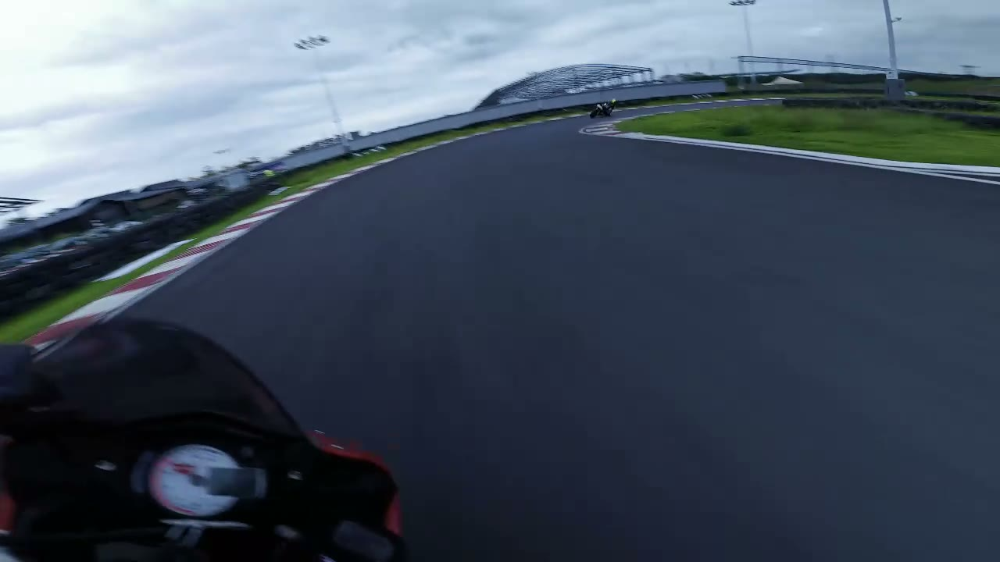
  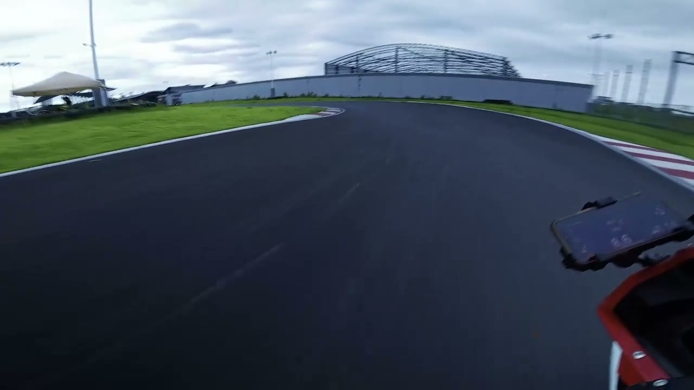
  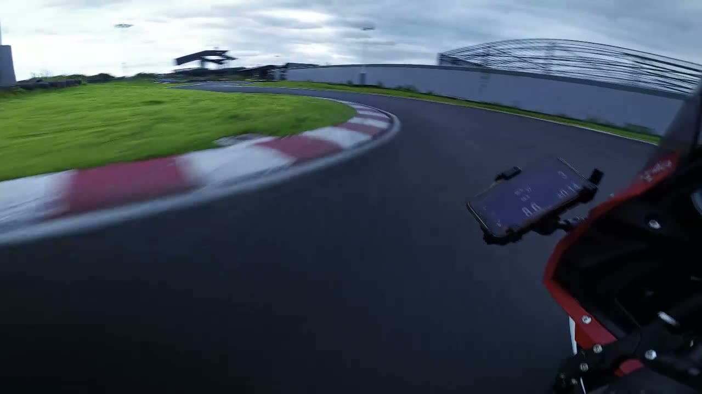

  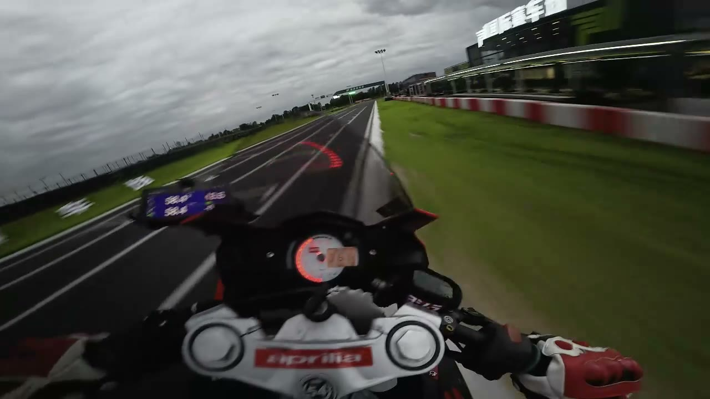
  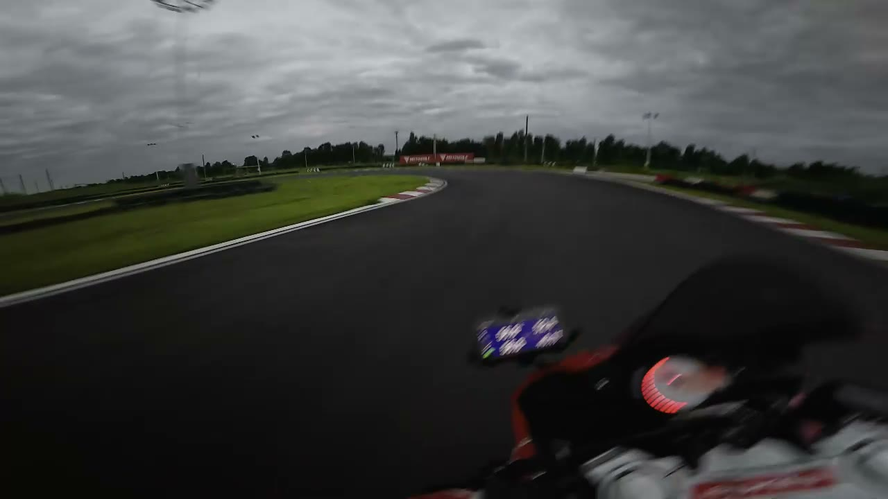
  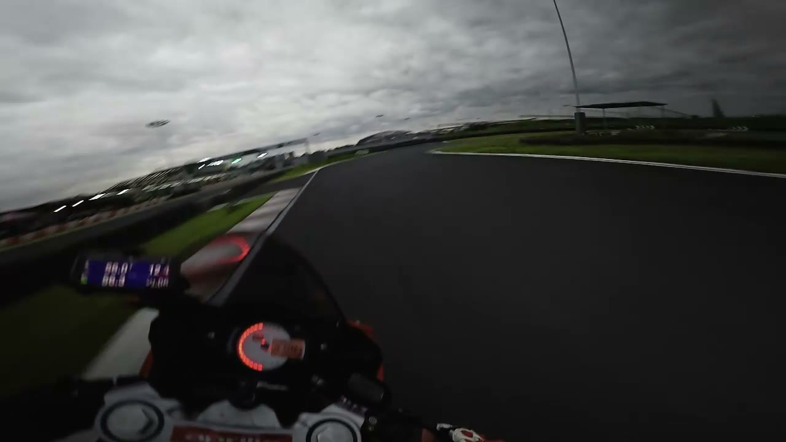

  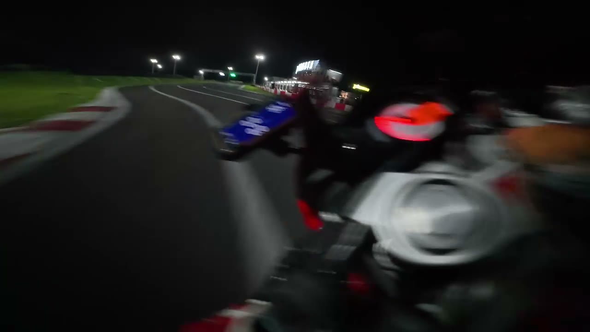
  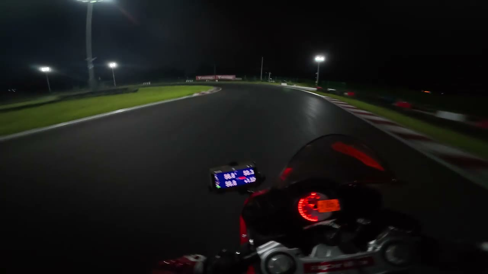
  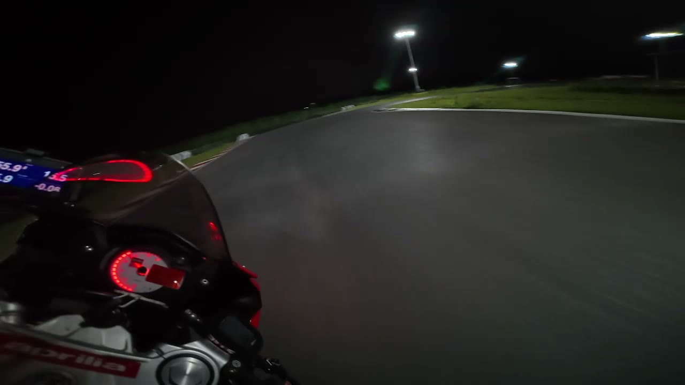

## Analysis figures

### Lap progression

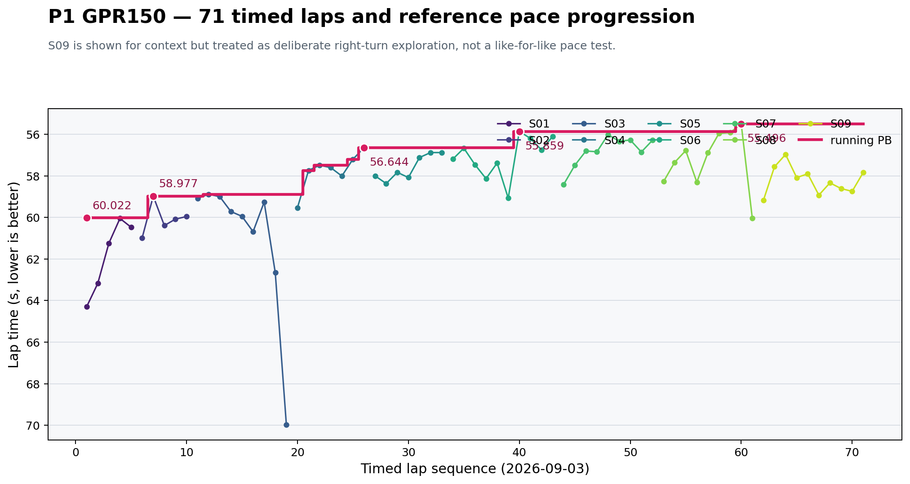

The running-PB line records the sequence `60.022 → 58.977 → 56.644 → 55.859 → 55.496 s`. The S09 points remain visible for context, while the session's deliberate right-turn exploration is kept separate from a like-for-like pace conclusion.

### Sector gain distribution

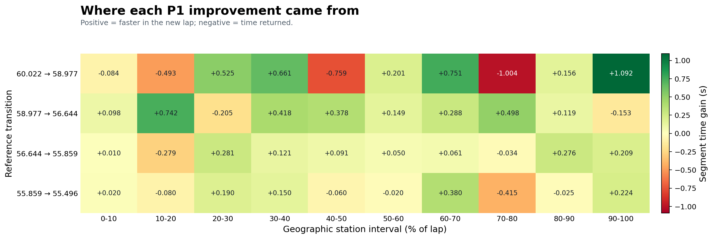

The heatmap shows why a local improvement cannot be read as a whole-lap explanation. In the final `55.859 → 55.496 s` step, the `60–70%` interval gained `0.380 s`, while the immediately following `70–80%` interval returned `0.415 s`. That pattern motivates video alignment across the linked transition.

### T1 gate versus full lap

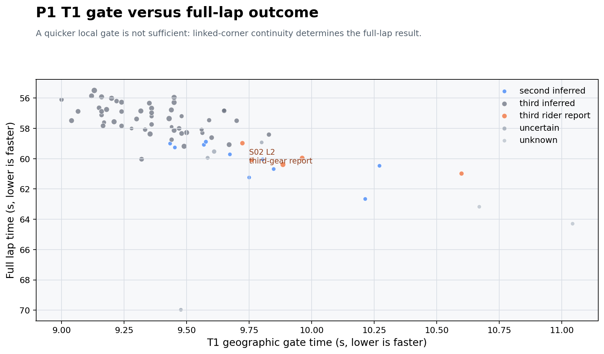

The T1 gate is a derived geographic comparison. Gear labels are rider-reported or inferred from GPS/RPM ratio, not a direct ECU gear channel. The figure therefore supports a continuity question rather than a claim that one gear is universally faster.

## Why this case matters

This is the clearest example of the project treating telemetry as an engineering record rather than a dashboard: source clocks and data quality are audited first, derived features are labelled, and interpretations are left open until the missing visual or physical evidence is available.
