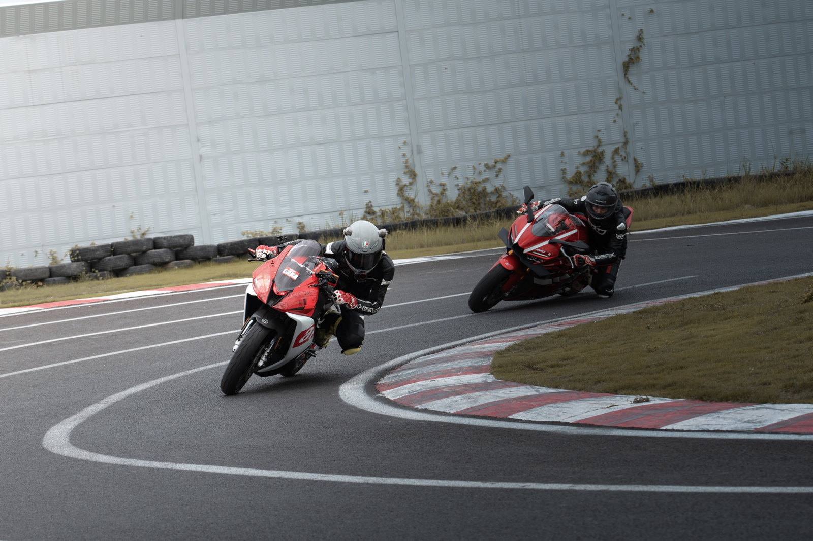
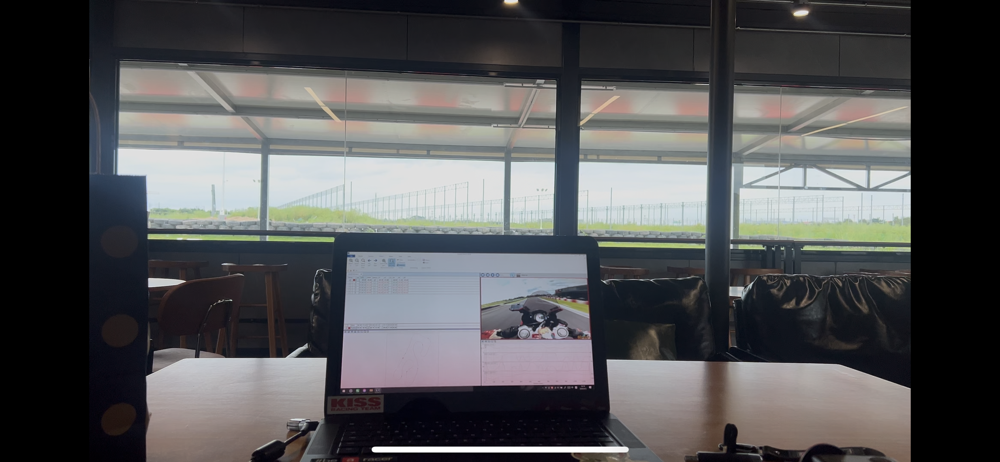
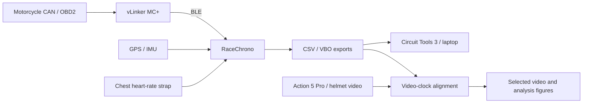

# aprilia GPR150 / P1
## Real-track data acquisition & performance analysis

[Portfolio contents](../README.md) · [中文概述](../zh/aprilia-gpr150-p1.md) · [Detailed analysis](p1-gpr150-analysis.md) · [Measurement methods](p1-gpr150-methods.md)

**Independent project · September 2026 · riding / acquisition / analysis**

P1 refers to P1 International Circuit, the circuit used for these sessions.

I connected RaceChrono to GPS, OBD and a heart-rate strap, aligned onboard video, and compared my recorded lines and control inputs across sessions.

The archive covers **nine sessions and 71 timed laps**. I trace changes from the braking reference through lean and throttle timing to the speed and time carried into the next corner.

### Selected work

- [T2 event comparison](#t2-lines-control-and-reference-development) — relate braking position, lean and throttle opening; track repeatability across 47 laps.
- [Linked corners and gain attribution](#whole-lap-performance-studies) — locate gains and losses using common geographic gates, measured lines and control traces.
- [OBD and rider-state analysis](#obd-control-timing-and-rider-state-analysis) — examine deceleration, engine recovery, lean duration and event-aligned heart rate.
- [Targeted driving comparisons](#targeted-driving-comparisons) — compare an intentional exercise, gear choice and consecutive laps.
- [Acquisition and evidence delivery](#acquisition-and-evidence-delivery) — connect the recording stack, synchronized video and trackside review.

## T2: lines, control and reference development

I compared laps in one spatial frame and detected sustained deceleration, lean and throttle events. A chronological view of all 47 comparable laps shows how the braking reference moved and how its repeatability developed.

In the selected S02 L2 / S08 L8 pair, deceleration starts **12.3 m farther downstream**, while the 20° lean landmark stays near the same approach position. Sustained 40% throttle moves from **1.50 to 0.10 s after minimum speed**.

The **20-second S04 onboard excerpt** shows the raised kerb at the T1 kink and the main T2 left. The synchronized overlay and original engine audio give the event analysis a physical reference. The measured pair above is S02 / S08; the video illustrates the intermediate S04 session.

[Read the complete T2 study: lines, opening and 47-lap reference history](p1-gpr150-analysis.md#t2-lines-control-and-reference-development) · [Onboard and mapped reference](p1-gpr150-analysis.md#t2-onboard-example-developing-a-repeatable-braking-reference)

## Whole-lap performance studies

### Linked-corner diagnosis

I placed common geographic gates across laps and joined split times with measured paths, throttle, speed and lean. Comparing a complete corner sequence reveals whether a local gain survives the following transition.

The S06 L7 / S08 L8 comparison finds **0.431 s gained in one block and 0.461 s returned in the next**. The board shows the relative lines; the detailed control panels explain the sequence behind that trade-off. I compare approaches by their combined time through both blocks.

[Read the linked-corner diagnosis](p1-gpr150-analysis.md#1-linked-sequence-a-quicker-right-hand-block-can-cost-the-next-transition)

### Lap-time gain attribution

I split laps at fixed geographic planes, accumulated the interval time differences, and compared lines and control traces in the largest gain region.

The final **0.424 s** improvement contains only **0.036 s from the opening package**. G20–G40 contributes **0.371 s**; subsequent gains and losses explain the finish result. I inspect the G20–G40 lines and control traces to explain the largest gain.

[Read the gain attribution and closer G20–G40 comparison](p1-gpr150-analysis.md#2-s08-consecutive-pbs-where-the-final-0424-s-came-from) · [Fixed-gate definitions](p1-gpr150-methods.md#fixed-geographic-comparisons)

## OBD, control timing and rider-state analysis

I synchronized GPS speed with OBD engine speed and throttle, then aligned the comparisons at the corner minimum. Calculated lean adds episode shape and duration; heart-rate windows add a separate view of my heart-rate response.

Selected laps can have similar exit speed and different engine-speed recovery: S07 L5 exits at approximately **7,106 rpm**, against **9,346 rpm in S08 L8**.

Heart-rate analysis uses a pre-event baseline and the shape of a defined response window, then compares that result with the session distribution. Lean analysis pairs peak magnitude with time spent at deep lean.

[Deceleration](p1-gpr150-analysis.md#deceleration-position-speed-loss-and-recovery) · [Engine recovery](p1-gpr150-analysis.md#engine-speed-recovery-what-the-speed-trace-leaves-out) · [Lean duration](p1-gpr150-analysis.md#lean-the-shape-and-duration-of-the-cornering-episode) · [Heart-rate response and mapped window](p1-gpr150-analysis.md#heart-rate-inspect-the-response-shape-against-the-session-pattern)

## Targeted driving comparisons

I compare each exercise through the same geographic sections, following its line and control inputs into the next corner.

The **S09 right-turn exercise** gains approximately **0.194 s** in the first block, then returns **0.510 s** in the following transition. The detailed comparison follows the path, throttle and right-to-left lean sequence, with whole-session lean distributions as context.

The **gear trial** compares RPM, throttle and speed through the opening package. In the **same-session L6/L7 pair**, L7 enters slightly slower and carries more speed through the following corner.

[Right-turn exercise](p1-gpr150-analysis.md#3-a-deliberate-right-turn-exercise) · [Gear-trial comparison](p1-gpr150-analysis.md#gear-choice-does-avoiding-a-shift-preserve-the-next-corner) · [Same-session comparison](p1-gpr150-analysis.md#same-session-contrast-entry-speed-versus-linked-corner-carry) · [Setup context](p1-gpr150-analysis.md#tyre-pressure-context)

## Acquisition and evidence delivery

I use **RaceChrono** with GPS, IMU and a chest heart-rate strap, plus a **vLinker MC+ BLE OBD2 interface** to the motorcycle's CAN-connected diagnostic port. A **DJI Action 5 Pro** records the helmet view. I align the video and telemetry afterwards, including additional camera views where available.

**Circuit Tools 3** on the pit-room laptop supports review between sessions and planning the next run. The analysis presented here also includes retrospective reconstruction of sessions ridden consecutively. Consumer hardware and DIY processing make the acquisition practical within my budget.

The linked reports contain the synchronized video, event maps, line and control comparisons, measurement definitions and aggregate data.

[Acquisition and trackside workflow](data-acquisition-workflow.md) · [Complete analysis](p1-gpr150-analysis.md) · [Methods and source notes](p1-gpr150-methods.md) · [Aggregate evidence](../assets/p1/p1-development-detail-summary.json)

[Back to portfolio contents](../README.md)
