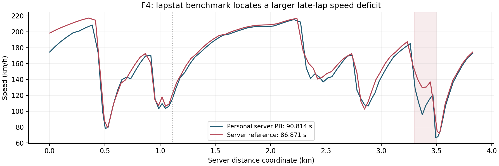

# SMP F4 / Paul Ricard: brake release, wheel loading and setup-test control

[Portfolio contents](../README.md)

**Practice on 2026-08-31 and 2026-09-01 · SMP F4 Gen 2 · Paul Ricard WTCC**

This development work combines repeated driving, replay-derived control analysis, Content Manager timing, server-reference speed traces and separate setup variants. The main problem was repeated loss of the rear axle through one S2 transition, which interrupted otherwise usable pace.

## Match the trace to the session

The inspected replay export contains **78,431 frames at 30 ms**. I matched its recorded valid-lap transition times against CM session `260831-235626`, rather than assigning it to an event from its filename. Seven valid transitions in the retained export match exactly at the stored millisecond precision.

That establishes a practice trace with controls, speed, four-wheel loading and damage information. It does not make this file a race result or a 50 Hz Live Telemetry capture.

## Recovering a repeatable four-lap sequence

After a disrupted lap, the session produced four consecutive valid laps:

| CM lap | S1 | S2 | S3 | Lap time |
|---|---:|---:|---:|---:|
| 13 | 18.583 s | 31.703 s | 42.848 s | 93.134 s |
| 14 | 18.713 s | 30.839 s | 41.953 s | 91.505 s |
| 15 | 18.677 s | 31.046 s | 41.580 s | 91.303 s |
| 16 | 18.095 s | 31.361 s | 44.028 s | 93.484 s |

The prior session PB was 92.444 s, with sectors 18.563 / 31.298 / 42.583 s. L15 improved it by 1.141 s; S3 contributed 1.003 s, while S1 was actually 0.114 s slower. The useful change was not uniform aggression around the lap.

## A faster S1 with earlier release

L28's valid S1 is **18.054 s**, 0.623 s faster than L15's 18.677 s. Rechecking the replay samples gives:

| S1 measure | L15 | L28 |
|---|---:|---:|
| First nonzero brake sample in the main braking event | 7.620 s | 7.290 s |
| Last nonzero brake sample in that event | 9.930 s | 9.300 s |
| Speed near the sector boundary | 146.8 km/h | 153.6 km/h |

These are elapsed times from lap start, not surveyed braking-point coordinates. The trace supports an earlier control sequence and a stronger sector exit. L28's complete lap is **97.227 s**, slower than L15: its local S1 success is a technique to reproduce within a clean full lap, not a whole-lap performance claim.

## Wheel load and the troublesome transition

L15 passes the same S2 transition with the right rear dropping to approximately **0.345 kN** while the recorded throttle is near full input. Other laps fail there. Low wheel load identifies the vulnerable phase but does not, by itself, identify the cause of every spin. I compare the load event with steering, throttle and the surrounding lap instead of labelling the curb universally unusable.

## Setup variants and decision records

The working record separates two variants:

- A: rear fast rebound reduced from 6 to 5, intended to investigate the unload/recontact transition.
- B: rear cold pressure reduced from 17 to 16 psi, with the fronts retained at 17 psi.

The event's adjustable-setting restriction excluded the damping variant from the race setup. The pressure variant remained a candidate. A later B-configuration practice session recorded a valid **91.005 s** lap, but repeated failures at the same S2 location remained. The observation is that usable speed survived; it does not prove that reducing pressure cured the instability or caused the PB.

The original preparation discussion also estimated a 25-minute fuel budget around 21 L from roughly 1.0-1.1 L per clean lap, and kept brake-bias/pressure decisions separate from exit-traction changes. This is a recorded planning estimate, not a verified race-consumption result.

## A second reference beyond personal PB

An archived server `lapstat` comparison contains a personal 90.814 s lap and an 86.871 s reference. Its speed-distance traces reveal a substantial deficit around 3.30-3.50 km in the final braking sequence, even though the repeated S2 failure naturally attracted more attention.

The server trace provides speed and distance, not the reference driver's throttle, brake or steering. I use it to select a region for examination, then use the local control trace to form a testable driving hypothesis.

See [aggregate evidence and source notes](../assets/sim/README.md).
