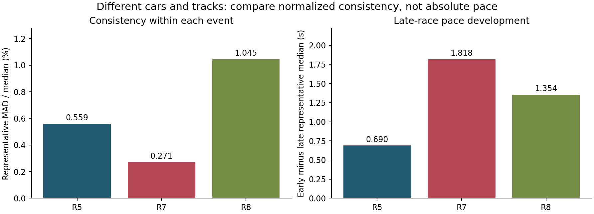

# Three race reviews: consistency, incident recovery and late-race pace

[Portfolio contents](../README.md)

**2026-08-05 / 19 / 26 · Assetto Corsa · MX-5 and Octavia Cup · Lime Rock and Paul Ricard WTCC**

I compared three formal online races after driving and reviewing each one. Across the different cars and tracks, I compare within-event pace spread, late-race development and recovery losses.

## A common statistical rule

For each event, I take the median and median absolute deviation (MAD) of all completed intervals, retain intervals within `median ± 3 × MAD`, and calculate the representative median, MAD and `MAD / median`. I compare the first and last three retained intervals in chronological order. Excluded laps stay in the full record and the incident review.

| Event | Completed intervals | Retained | Representative median | MAD | Relative MAD | First three to last three |
|---|---:|---:|---:|---:|---:|---:|
| R5, MX-5 / Lime Rock | 26 | 19 | 59.070 s | 0.330 s | 0.559% | 59.310 to 58.620 s |
| R7, Octavia / Paul Ricard | 12 | 9 | 105.441 s | 0.286 s | 0.271% | 107.043 to 105.225 s |
| R8, MX-5 / Paul Ricard | 14 | 11 | 107.898 s | 1.127 s | 1.045% | 107.818 to 106.464 s |

All three events show faster late representative laps. R7 combines a narrow retained pace band with two mid-race repairs and long recovery intervals; the timeline shows where that consistency was interrupted.

## Joining damage, lap timing and validity

I group closely spaced jumps in the replay damage channels into damage episodes.

- **R5:** two opening-lap damage clusters, then no additional damage during the remaining race and no mid-race repair. Official P5 and the game-side P16 start are corroborated by stored result evidence.
- **R7:** three damage episodes and two repairs. The representative laps narrow to a stable band, but recovery intervals of roughly 214-259 s dominate race continuity. The retained summary has no finishing-position record.
- **R8:** four in-race episodes, no mid-race repair, plus a separate post-finish episode. After a 133.520 s fifth completed lap, the next six completed laps progress from 109.496 to **105.665 s**.

The R8 result is game-side P18 to P13. Its 105.665 s PB occurs on completed lap 11 of 14, with zero cuts; completed laps 12-14 have cuts. The final practice priority is to reproduce that late-race pace across consecutive valid laps.

## Sector allocation changes the next practice task

The R8 PB is 2.902 s behind the session's fastest 102.763 s lap. The sector differences are **+0.018 / +1.651 / +1.233 s**. That focuses the next practice on S2/S3 while preserving the already close S1. It also separates a local sector success from the remaining whole-lap deficit.

My practice targets are to retain the late-race pace, address recurring damage and cuts, and complete consecutive valid laps in that pace band.

## Source distinctions

R5 has an official result snapshot; R8 uses the preserved local result summary and a corroborating replay. R7's accepted `personalbest.ini` value of 104.006 s is distinct from its 104.845 s replay-reconstructed best interval. The comparison table uses replay-reconstructed completed intervals.

See [aggregate evidence and source notes](../assets/sim/README.md).
