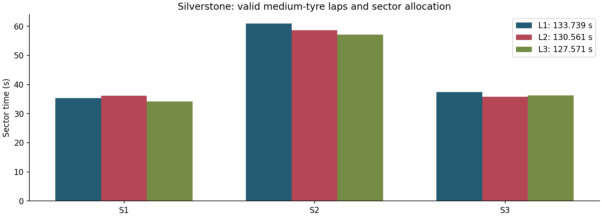

# GT1 / Silverstone: time-loss allocation, tyre state and controlled testing

[Portfolio contents](../README.md)

**2026-09-12 · Assetto Corsa · RSS GT Shadow V8 · Silverstone GP OSRW**

I drove and analysed a prequalification practice programme, combining CM laps and validity flags, the saved setup and **50 Hz Live Telemetry with 64,544 samples**. The work covers driving performance, brake/tyre behaviour and the next setup test.

## Valid laps and sector allocation

Three valid medium-tyre laps progress from **133.739 to 130.561 to 127.571 s**:

| Lap | S1 | S2 | S3 | Total |
|---|---:|---:|---:|---:|
| 1, medium | 35.374 s | 60.984 s | 37.381 s | 133.739 s |
| 2, medium | 36.142 s | 58.630 s | 35.789 s | 130.561 s |
| 3, medium | 34.156 s | 57.181 s | 36.234 s | 127.571 s |

The medium-only best-sector composite is **127.126 s**, just 0.445 s below the best completed valid lap. The subsequent soft-tyre laps are invalid: their best S2 is 56.515 s, but none converts that sector gain into a valid faster lap. A composite using an invalid soft-tyre sector is a different diagnostic and is not promoted to an achieved lap time or a proven tyre choice.

## Where the gain was made and returned

Comparing the final valid lap with the previous one:

| Measure | 130.561 s lap | 127.571 s lap |
|---|---:|---:|
| Average speed | 160.2 km/h | 163.8 km/h |
| Maximum speed | 260.4 km/h | 260.6 km/h |
| Full-throttle time | 58.3 s | 66.1 s |
| Brake-active time | 18.2 s | 17.6 s |
| Coasting time | 10.8 s | 11.0 s |

At approximately 60% track progress, the final lap was already 3.616 s ahead; the remaining section returned about 0.631 s. The largest gains were around Village/Loop/Aintree, Brooklands/Luffield and Copse. Copse-window minimum speed increased from about 144.7 to 152.1 km/h.

The almost unchanged maximum speed directs attention to corner execution and throttle connection. It does not establish a causal setup improvement: the review is comparing observed laps within the programme.

## Brake and wheel-speed interpretation

The wheel-speed/brake traces show front-wheel lockup signals around Village, Becketts and Vale, especially at the right front. The inspected baseline has no ABS, 61% front brake bias and 100% configured brake power.

That turns a general braking complaint into a concrete test: change front bias from **61.0% to 60.5%**, hold the rest of the setup fixed, then compare wheel-speed drops, brake release, exit speed and valid-lap consistency in the same zones. This remains a proposed test, not an already successful setup change.

## Tyre and compound management

With four cold pressures set to 20 psi, the end of the fastest medium lap records:

| Wheel | Hot pressure | Core temperature |
|---|---:|---:|
| LF | 28.22 psi | 80.8 C |
| RF | 27.88 psi | 78.5 C |
| LR | 28.96 psi | 85.7 C |
| RR | 28.08 psi | 79.9 C |

The later soft-tyre segment reaches about 29.82 psi and 91.4 C at the left rear. Combined with repeated S3 errors and invalid laps, this supports keeping a medium-tyre baseline until a comparable soft stint exists. The temperature asymmetry is an observation to monitor, not sufficient evidence that the tyre caused every mistake.

## Fuel, conditions and session identity

The CM record reports 49.904 km and 31.4 L consumed, equivalent to approximately **3.70 L per 5.891 km lap**. The final saved setup contains 18 L; that is a setup snapshot, not the whole-stint consumption value. Server practice conditions of 26 C air / 34 C track are kept separate from the event page's target 18 C / 30 C conditions.

A later capture carries a Silverstone/Shadow filename but matches a CM Macau/Evo session. It is excluded from this case because startup metadata was stale. Filename matching alone would have contaminated both the performance comparison and tyre conclusions.

The event record is prequalification practice: the deadline was missed, access to the race server was not granted and no race start occurred. The completed engineering output is the practice analysis and next-test plan.

## From wheel speed to driving and setup decisions

This is the recorded **2:07.571 medium-tyre lap**, at 72–99% progress. Wheel speeds remain in their native rad/s units: the figure compares the four channels directly without assuming an effective tyre radius or plotting angular speed as road speed.

The visible right-front collapse occurs at **90.15–90.71% progress**: its angular speed falls below **5 rad/s**, reaching zero, while vehicle speed remains **135–176 km/h** and brake input is **79–97%**. Both rear wheels continue rotating above 93 rad/s. This identifies a front-lockup window to examine alongside pedal release, rather than a general lack of straight-line speed.

I examine four-wheel angular speed alongside vehicle speed, brake input, steering, wheel load and the saved setup. In a braking window, an abrupt front-wheel speed drop relative to the car and the other wheels supports a lockup diagnosis. I distinguish it from a sustained left/right difference while turning, and use load information to identify a lightly supported wheel. Brake release and wheel-speed recovery show whether the event persists into turn-in.

For this session, the repeated front-wheel events at **Village, Becketts and Vale**, especially at the right front, support two concrete actions:

- **Driving:** compare peak brake input and release through turn-in, then assess the exit and the next acceleration segment. A later braking point is useful only if the downstream loss does not outweigh the entry gain.
- **Setup:** propose **front brake bias 61.0% → 60.5%**, keeping **100% brake power, medium tyres and the other settings** fixed. Compare recurrence/duration of front-wheel drops, any new rear instability, sector exit speed and consecutive valid laps. The saved baseline has no ABS; this proposal remains a test, rather than a completed improvement.

The tyre evidence selects the comparison baseline too. The valid fastest medium lap ends near **27.88–28.96 psi** across the four tyres; a later invalid soft lap reaches **29.82 psi / 91.4°C at the left rear**. I retain medium tyres for the brake-bias comparison so that compound and thermal state do not change alongside bias.

This links the CV's “wheel speed, wheel load and setup” to specific measured channels, diagnostic windows and controlled test decisions.

See [aggregate evidence and source notes](../assets/sim/README.md).
