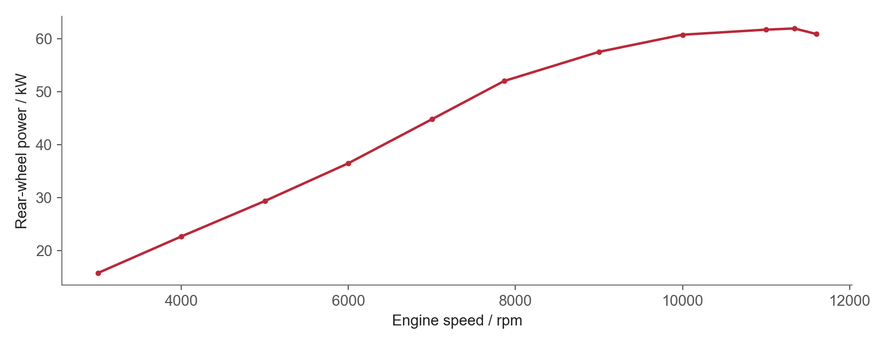
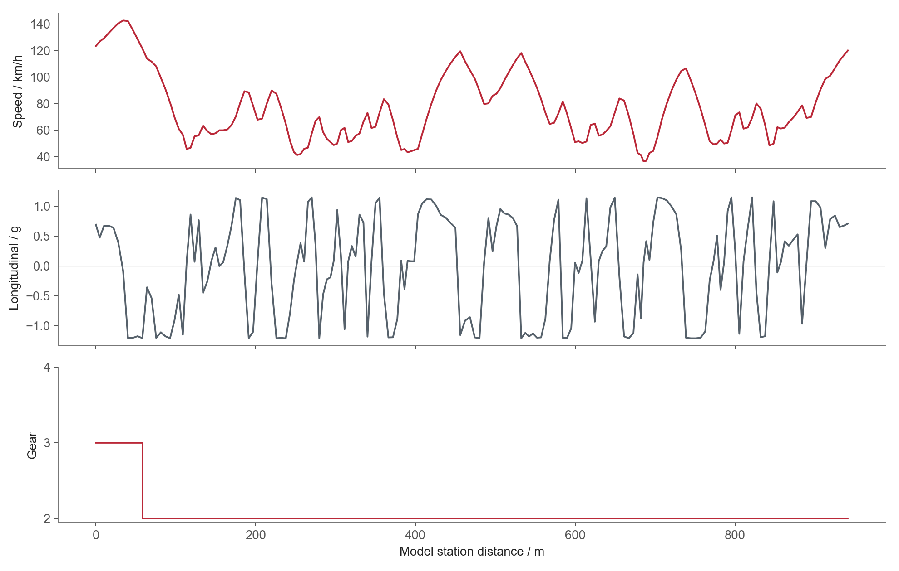

# CBR650R / P1 — inputs, assumptions and calculation

[Modelling showcase](lap-time-modelling.md) · [Code and data](code/README.md)

## From measured riding data to a vehicle model

I built this model from my **11 July 2026 CBR650R / P1** programme, separate from the September aprilia GPR150 analysis. The archive contains five TrackAddict sessions, corrected lap timing, position/speed and camera observations. The selected scale reference is a corrected **59.000 s lap with 60 GPS updates**, whose sampled chord totals **895.390 m**. The CSV has 20 Hz rows, but position updates are approximately 1 Hz.

Camera display observations around 42–47° supply achieved-demand anchors: a level-road steady-state approximation, `ay/g ≈ tan(phi)`, gives approximately **0.90–1.07 g**. These observations contextualise the model envelope; camera/body angle is distinct from an identified tyre-force coefficient.

### Vehicle-specific inputs

| Input | Value | Source / treatment |
|---|---|---|
| Curb / combined mass | 208 kg / 260.25–263.25 kg | Manual, measured body mass and an equipment-mass bracket |
| Wheelbase | 1.45 m | Honda service manual, printed p. 1-5 |
| Primary / final reduction | 1.69 / 2.80 | Manual p. 1-6; 15T/42T sprockets |
| Gear ratios 1–6 | 3.071 / 2.352 / 1.888 / 1.560 / 1.370 / 1.214 | Manual p. 1-6 |
| Loaded rear radius | 0.31 m | Scenario approximation for speed-to-rpm conversion |
| Dyno interval | 3,000–11,600 rpm | Retained wheel-power curve |
| Rear-wheel power peak | 84.21 PS ≈ 61.94 kW at 11,338 rpm | Vehicle-specific Dyno Pro run, 17 June 2026 |
| Torque anchor | 63.23 Nm at 7,863 rpm | Same engine-referenced dyno trace |
| Curve sensitivity | ±5% output | Intermediate points digitised/transcribed from the dyno image |
| Tyres / pressures | Road 6; cold 2.1/2.2 bar, hot 2.4/2.6 bar | My measured front/rear values at P1 |

The curve contains eleven retained points. At each road speed, I calculate rpm in each legal gear, interpolate wheel power and select the best available gear. The interpolated rear-wheel power feeds directly into the acceleration ceiling. The [input contract](data/cbr650r-inputs.json) contains the actual values used by the published code.

## What “given adhesion assumptions” means

I construct **separate lateral, braking and rear-drive ceilings**:

| Archived scenario | Lateral | Straight braking input | Rear traction input | Output scale | Combined mass |
|---|---:|---:|---:|---:|---:|
| Achieved-demand conservative | 0.90 g | 0.846 g | 0.90 g | 0.95 | 263.25 kg |
| Achieved-demand upper | 1.07 g | 0.846 g | 1.00 g | 1.05 | 260.25 kg |
| Nominal dry extrapolation | 1.15 g | 1.12 g | 1.10 g | 1.05 | 260.25 kg |
| Upper dry extrapolation | 1.22 g | 1.22 g | 1.15 g | 1.05 | 260.25 kg |

The archived 0.846 g input was calculated from a Road 6 GT wet straight-braking test, `100 km/h → 0 in 46.5 m`, using `v²/(2s)`. I use that wet-test value as the conservative braking input. The dry values are scenario inputs. A later **2.00 g lateral working scenario** explores a higher vehicle envelope independently of my current riding capability.

The combined centre-of-mass height and front static load fraction are also explicit assumptions: **0.65 m / 0.46** in the conservative case and **0.60 m / 0.50** in the dry cases. Their lift ceilings are:

`a_wheelie/g = front_fraction × wheelbase / h_CG`

`a_stoppie/g = (1 − front_fraction) × wheelbase / h_CG`

The dry geometry gives **1.208 g**. Thus the upper scenario's requested 1.22 g braking input is clipped to 1.208 g. Chassis assumptions directly change the usable envelope.

## Calculation chain

1. Rectify my photographed circuit board, annotate connected pavement cross-sections and search lateral position within that road corridor. Calculate segment lengths and curvature on the closed path.
2. Build the speed-dependent drive ceiling from `P_wheel/(m v)`, rear traction and wheelie limits. Build braking separately from tyre demand and stoppie limits.
3. Calculate cornering demand `ay = v² |curvature|`. A combined-force ellipse reduces the available longitudinal force as cornering demand rises.
4. Run forward acceleration and backward braking-feasibility passes until the closed speed profile converges. Integrate `dt = 2 ds / (v_i + v_next)`.
5. Use lateral control-point pattern search to improve time; recheck the line against the original pavement. The working run uses **30 lateral controls, 180 stations and 181 evaluations**.

The candidate keeps **0.184 m minimum hard-pavement clearance** for the model reference line. The clearance calculation uses the model reference line.

## GPS observation model and scale check

Sparse GPS cuts across curves. I sample the physical candidate at the observed GPS update phase, using its relative traversal timing rescaled to the measured 59 s lap, and fit scale against the resulting **sampled chord**.

The working candidate's scale is **0.184205 m/pixel**. Its physical polyline is **907.408 m**; its simulated GPS chord is **894.680 m**, compared with **895.390 m** observed. The residual is **−0.710 m, approximately −0.079%**. This is the residual against the observation used for scale fitting. A one-step scale refit gives 0.184369 m/pixel and exposes remaining line/scale coupling.

## Outputs that support engineering judgement

- **Envelope sensitivity:** the nominal 1.15 g scenario gives **57.303 s**; the higher 2.00 g working scenario gives **45.869 s**, with **36.4–142.7 km/h** speed. Each scenario has its own searched path and scale fit.
- **Gear feasibility:** the nominal candidate's **28.9 km/h** minimum leaves **five stations** without a legal 2nd–4th gear within the retained dyno interval. That identifies a need for lower-rpm data, first gear or a changed path/speed profile.
- **Finite shifts:** the higher-envelope candidate admits a closed 2nd–4th policy, using second and third gear with **two shifts**. A 0.20 s/shift allowance gives **46.269 s**. The shift allowance is added to the fixed-path timing.
- **Transient screening:** its equivalent roll-rate proxy peaks at **9.663 rad/s**, exceeding the reduced-model **3.0 rad/s** guardrail. Steering-rate demand peaks at **0.775 rad/s**, below 5.0 rad/s. The roll screen withholds the candidate as a riding line; its maximum occurs at the periodic boundary and needs examination during transient continuation.

The model gives me a speed profile, legal-gear checks and a list of limiting sections to inspect. The 45.869 s candidate uses the exploratory 2.00 g envelope and requires transient refinement at the failed roll-rate screen.

[Archived result values](data/archived-result-summary.json) preserve the historical calculations. The [runnable subset](code/README.md) exposes the actual vehicle-envelope and fixed-line implementation.
