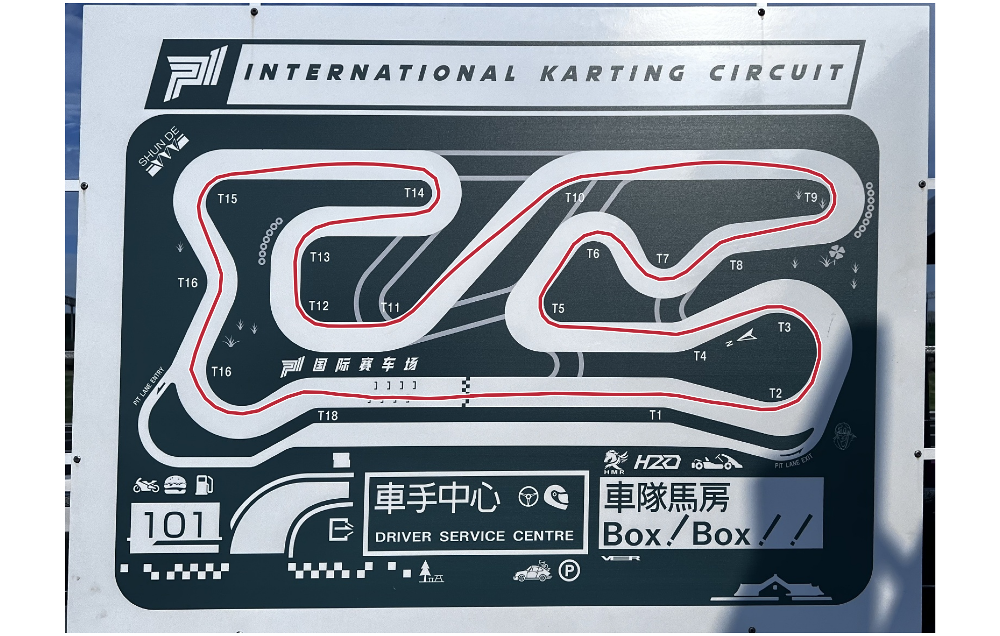

# Vehicle and lap-time modelling

[Portfolio contents](../README.md)

I built a CBR650R-specific P1 model from my measured track data, vehicle parameters, rear-wheel dyno curve and photographed circuit board. The work connects physical inputs to path search, speed solution, gear selection and checks that change the engineering interpretation.

Computed path with a 2.00 g exploratory lateral envelope. The speed solution and rate screen below identify the candidate’s performance and the sections requiring transient refinement.

## Concrete implementation and results

- **Inputs:** 208 kg curb mass, 1.45 m wheelbase, six gear ratios, 15/42 final drive and 84.21 PS rear-wheel peak. Equipment mass and digitised dyno output are carried as ranges.
- **Track geometry:** connected pavement cross-sections and GPS-observation scale fitting. The working candidate's sampled chord differs from the measured chord by −0.710 m, approximately −0.079%.
- **Calculation:** asymmetric acceleration/braking envelopes, combined-force limits, forward/backward speed passes and lateral control-point path search.
- **Outputs:** a 57.303 s nominal dry candidate and 45.869 s higher-envelope candidate. Each result uses its stated envelope and a separately searched path.
- **Checks:** the nominal candidate has five low-speed stations incompatible with a 2nd–4th gear policy. The faster candidate admits two shifts, giving 46.269 s with a 0.20 s/shift allowance, but fails the reduced-model roll-rate screen at 9.663 rad/s versus a 3.0 rad/s guardrail.

[Inputs, equations and worked results →](cbr650r-p1-model.md) · [Runnable model subset →](code/README.md) · [Archived aggregate values →](data/archived-result-summary.json)

## Numerical methods

My separate [sparse optimal-control solver](sparse-optimal-control.md) demonstrates active sets, generalized-Jacobian assembly and sparse block-system solving. The motorcycle project also includes exploratory reduced-transient and SSN/KKT formulations.
