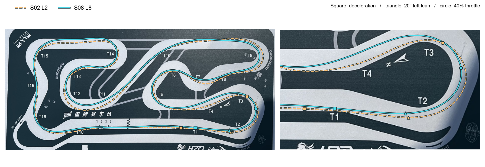
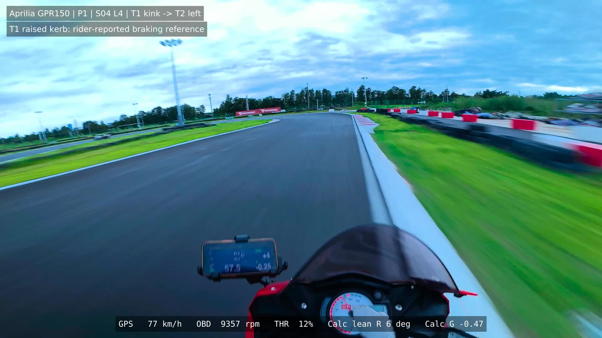
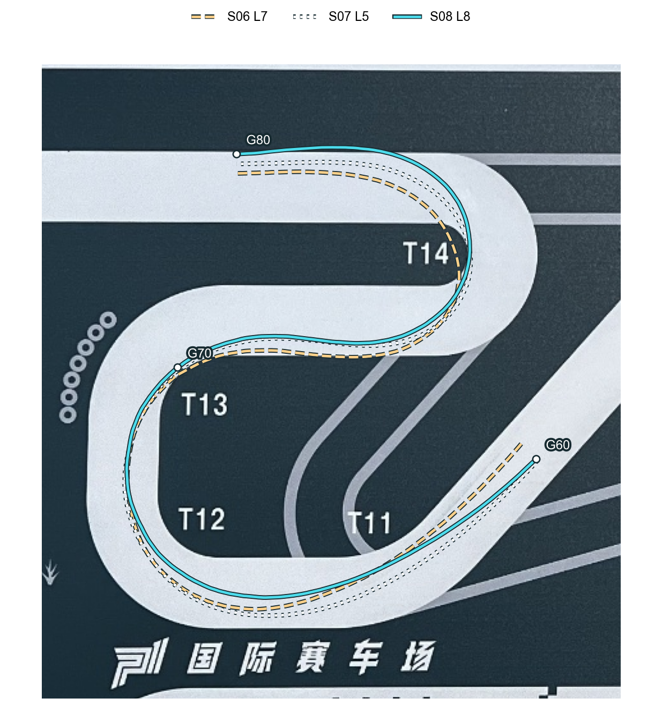
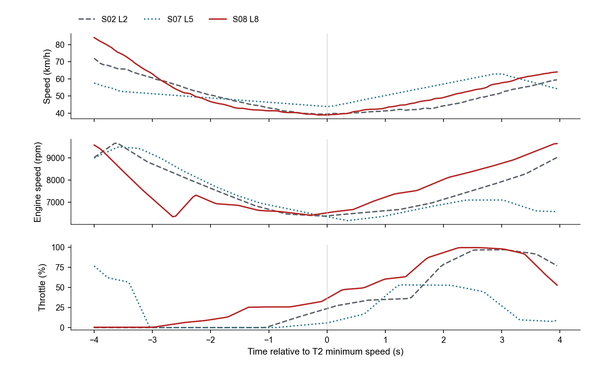

# aprilia GPR150 / P1：实车采集与性能分析

[中文首页](../README.zh-CN.md) · [English](../case_studies/p1-gpr150-telemetry.md)

**2026 年 9 月 · P1 国际赛车场 · 独立骑行、采集与分析 · 九节练习、71 个计时圈**

我用 RaceChrono、GPS、OBD、心率带和车载影像记录自己的赛道练习。分析从一个具体问题展开：刹车参照后移以后，入弯、开油和后续连续弯发生了什么变化，省下的时间能保留多远？

## 刹车参照、入弯与开油

我将各圈轨迹放在共用坐标系中，检测持续减速、倾角变化和开油事件，再映射到自己拍摄的 P1 赛道板上。47 个可比计时圈按练习顺序排列，展示参照点逐步后移和稳定性的变化。

S02 L2 与 S08 L8 的减速起点相差 **12.3 m**，后者更靠近主左弯；20° 倾角标记仍接近同一入弯位置。最低速度之后，持续达到 40% 油门的时间从 **1.50 s 缩短到 0.10 s**。我把这些事件一起比较，追踪入弯变化如何衔接到出弯。

这段 **20 秒 S04 影像**展示了 T1 路肩凸起、直道后的 T2 主左弯和驾驶过程，叠加速度、转速、油门、计算倾角与纵向 G，保留发动机原声。影像中的路肩凸起是我逐步尝试后采用的刹车参照。

[完整 T2 分析与参照演变](../case_studies/p1-gpr150-analysis.md#t2-lines-control-and-reference-development) · [视频对齐与实景参照](../case_studies/p1-gpr150-analysis.md#t2-onboard-example-developing-a-repeatable-braking-reference)

## 连续弯：收益如何保留

我用固定地理截面划分区段，联合线路、速度、油门与左右倾角变化比较整个连续弯组。

S06 L7 与 S08 L8 的比较中，一个区段节省 **0.431 s**，接下来的转换却损失 **0.461 s**。我据此查看右弯线路、开油后再次收油，以及车辆从右倾转向左倾的过程。

最后两个 PB 之间的 **0.424 s** 改善，主要来自 G20–G40 的 **0.371 s**。逐段累积时间差后，我进一步比较这段线路和控制动作，解释整圈改善的来源。

[连续弯诊断](../case_studies/p1-gpr150-analysis.md#1-linked-sequence-a-quicker-right-hand-block-can-cost-the-next-transition) · [连续 PB 的收益分解](../case_studies/p1-gpr150-analysis.md#2-s08-consecutive-pbs-where-the-final-0424-s-came-from)

## OBD、倾角与心率

我将 GPS 速度与 OBD 转速、归一化油门同步，在最低速度或共同地理截面处对齐各圈。相近的出弯速度也可能对应不同的发动机恢复过程：S07 L5 出口约 **7,106 rpm**，S08 L8 约 **9,346 rpm**。

倾角分析同时比较峰值和持续时间；心率则以减速事件前的基线为参照，查看后续窗口形状及各节分布。我也保留 S09 专项右弯练习、挡位尝试和同节连续圈的比较，用练习目标解释控制动作和区段结果。

[OBD、倾角与心率分析](../case_studies/p1-gpr150-analysis.md#obd-control-timing-and-rider-state-analysis) · [挡位与同节对比](../case_studies/p1-gpr150-analysis.md#supporting-driving-and-setup-comparisons)

## 采集与交付

采集栈包括 RaceChrono、GPS／IMU、胸部心率带、vLinker MC+ BLE OBD2 和 DJI Action 5 Pro 头盔影像。我用 Circuit Tools 3 在 P 房笔记本上复盘，赛后继续完成多机位与遥测对齐。

最终输出包括同步视频、事件位置图、线路与控制曲线、区段收益分解和可查看的汇总数据。S04–S07 连续骑行后的变化来自赛后复盘，其余工作流也包含节间分析与下一节计划。

[详细分析](../case_studies/p1-gpr150-analysis.md) · [测量方法](../case_studies/p1-gpr150-methods.md) · [采集工作流](../case_studies/data-acquisition-workflow.md) · [汇总数据](../assets/p1/p1-development-detail-summary.json)
