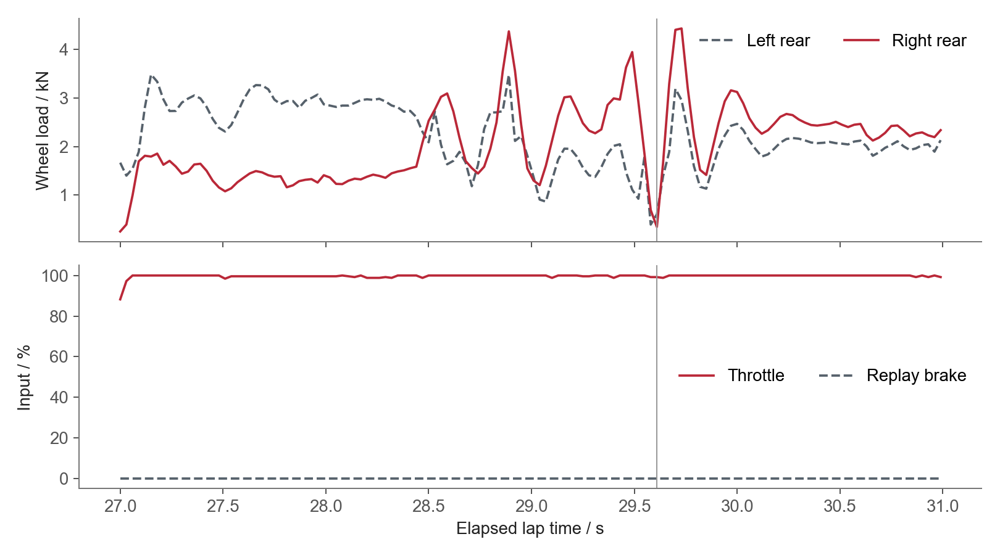
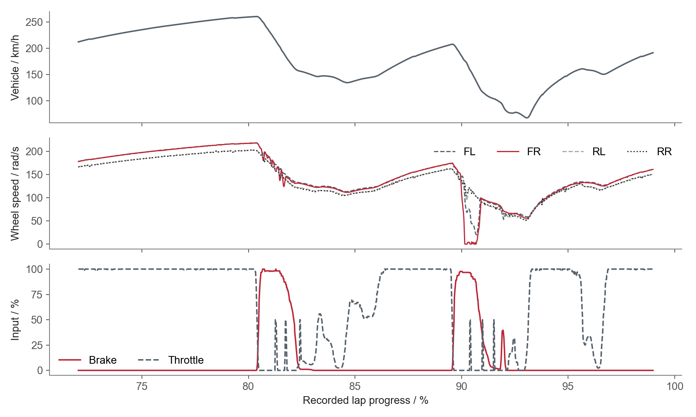

# 模拟赛车：性能分析与车辆状态诊断

[中文首页](../README.zh-CN.md) · [English](../SIM_RACING.md)

这些练习和比赛由我自己驾驶，之后用成绩、回放、游戏保存的最佳圈文件和遥测做分析。案例包括排位有效圈、比赛时间损失、松刹车过程、轮载、轮速和设定测试。

## MX-5 / Lime Rock：比赛损失与数据恢复

这场比赛从 **P16 发车、P5 完赛**，比赛 PB 为 **57.784 s**。分析中，我先将排位差距分到三个扇区：S1 占与杆位差距的 **60.5%**；再计算比赛慢圈损失，七个超过 61 s 的圈，相比 59.31 s 的参考圈速累计损失 **28.50 s**。

比赛前因 CPU 占用突增，关闭了高频遥测记录，本地回放只保留末段。我整合完整共享回放、成绩记录和原生 `.tc` 文件，恢复比赛时间线。回放的刹车数据只有开／关，可以定位开始刹车的时刻；松刹车的完整曲线则从最佳圈文件读取。

分析列出排位差距、有效圈比例、慢圈损失、车流和损伤发生时间，并附上最佳圈的操作曲线。后续练习重点是增加有效排位圈、改善 S1，减少反复出现的慢圈。

[完整 MX-5 案例](../case_studies/lime-rock-mx5-race-analysis.md)

## F4 / Paul Ricard：松刹车过程与后轮轮载

我将 **78,431 帧、30 ms 间隔**的回放导出与 Content Manager 圈速记录匹配，比较驾驶动作和轮载。两圈相比，S1 快了 **0.623 s**：松刹车更早，扇区出口速度提高 **6.8 km/h**。

在 91.303 s 圈的 **29.610 s** 处，右后轮载为 **344.75 N**，左后为 **605 N**，油门约 **99.2%**。我对照轮载、转向、油门和回放中的位置，查看经过路肩的线路及开油时机。

我提出过后减震器高速回弹 **6→5**、后轮冷胎压 **17→16 psi** 两个分别测试的方案。赛事规则限制了回弹调整；胎压方案的后续练习跑出 **91.005 s** 有效圈，但同一处转向衔接仍然出现失误。

[完整 F4 案例](../case_studies/paul-ricard-f4-development.md)

## GT1 / Silverstone：抱死位置与刹车配比

这次练习保留 **50 Hz、64,544 个采样点**，三圈有效中胎圈从 **133.739 s** 改善到 **127.571 s**。我对照四轮轮速、刹车、油门、轮载、轮胎状态和设定记录，找出重刹时前轮抱死的位置和持续时间。

在最佳有效中胎圈的 **90.15–90.71%** 位置，右前轮角速度降到 **5 rad/s 以下**并触及零，车辆速度仍为 **135–176 km/h**，刹车输入为 **79–97%**。我提出将前刹车配比从 **61.0% 改为 60.5%**，只改这一项，保持中胎、100% 制动力和其余设定不变。

这项测试尚未执行。计划比较前轮抱死时间、后轮稳定性、出弯速度和连续有效圈，并在相近的轮胎热压与温度下进行。

[完整 GT1 案例](../case_studies/silverstone-gt1-sim.md)

## 圈速稳定性与数据处理

我用中位数和中位绝对偏差（MAD）筛选正常圈，比较三场比赛的圈速波动，同时列出维修、损伤、切弯和事故后的时间损失。后续练习要把比赛后段的速度保持在连续有效圈里。

我用 Python、NumPy 和 Matplotlib 读取文件、对齐不同来源的时间、计算分段结果并绘图。回放解码使用 `acreplay-parser`，连续遥测使用 Live Telemetry。

[三场比赛一致性](../case_studies/paul-ricard-race-consistency.md) · [采集与数据恢复](../case_studies/data-acquisition-workflow.md#simulator-acquisition-and-recovery) · [图表来源与汇总数据](../assets/sim/README.md)
